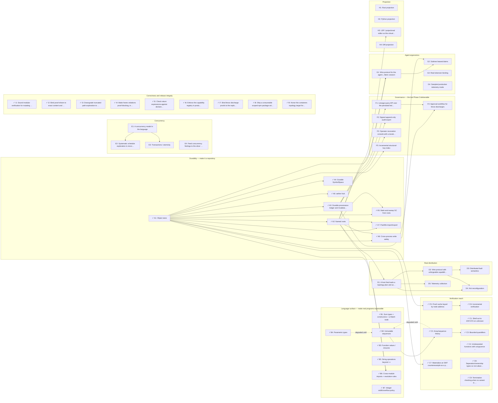

# Aether — gap-closing roadmap

Everything in the PRD's functional requirements is implemented. This document
inventories what stands between the reference implementation and a product.

Sizes are relative (S < M < L < XL), not estimates in time. The dependency
graph in §2 is generated from `roadmap/features.ts` and machine-checked by
`test/roadmap.test.ts` — the tables below and the graph are verified to agree,
so neither can drift from the other. Completed items remain in the graph with
positive source evidence, preserving the history of what the roadmap closed.

---

## 1. Inventory

### A. Durability — make it a repository

`GraphStore` is a `Map`. Everything else in this epic follows from that.

| # | Feature | Why | Size |
|---|---|---|---|
| A1 | Object store: write-once blobs keyed by node address, read-through cache | The graph must outlive a process | M |
| A2 | Named roots (branches/tags) + a commit object binding root × provenance × time | Otherwise there's nothing to *find* a module by | S |
| A3 | Durable provenance ledger and `InvalidatedSpec` flags | Currently in-memory Maps; the audit trail dies on exit | M |
| A4 | Durable `SymbolSpace` | The `SymbolTable` is already a node; the allocator isn't | S |
| A5 | Mark-and-sweep GC from roots | Every edit mints nodes; without this it only grows | M |
| A6 | `aether fsck` — re-hash every object, confirm the address matches | Content addressing makes corruption *detectable*; nothing detects it yet | S |
| A7 | Packfile import/export | Ships a repo, and makes the 94.6% dedup figure a measurement on disk | M |
| A8 | Cross-process write safety: temp-file + atomic rename, CAS on root updates | The lock-free claim currently holds *within one process* only | M |

### B. Language surface — make real programs expressible

| # | Feature | Why | Size |
|---|---|---|---|
| B1 | Sum types + constructors + a `Match` node | This is what makes `Result` real. Error handling is currently unexpressible | L |
| B2 | Immutable sequences (index, length, map/fold) | No collection type exists at all | L |
| B3 | Function values / closures | **Interesting OCap problem**: a closure captures authority, so the envelope becomes part of the value | XL |
| B4 | Parametric types | B2 is barely usable without it | L |
| B5 | String operations beyond `++` | Currently concat only | M |
| B6 | Cross-module imports + resolution rules | No multi-module repository is possible today | M |
| B7 | Integer width/overflow policy | Everything is arbitrary-precision; real targets have widths, and this changes both the solver and the production compiler | M |

### C. Verification reach

| # | Feature | Why | Size |
|---|---|---|---|
| C5 | Proof cache keyed by node address | The payoff of content addressing that isn't exploited yet — a proved subtree never needs re-proving. Cheap, large win | S |
| C6 | Incremental verification: re-verify only what changed, or whose callee contracts changed | Follows directly from C5 | M |
| C1 | Shell out to Z3/CVC5 on `unknown` — itself capability-bounded | The "escape velocity" claim is currently untested | S |
| C2 | Array/sequence theory | Required by B2 or verification silently degrades to fuzzing | L |
| C3 | Bounded quantifiers | "for all elements…" is unexpressible | L |
| C4 | Uninterpreted functions with congruence closure | Currently only implicit via abstraction | M |
| C7 | Materialize an SMT counterexample as a persisted micro-world case | Every refutation becomes a permanent regression test | S |
| C8 | Separation/ownership types so non-aliasing is *checked* | Open question 3; currently reported as an assumption | XL |
| C9 | Termination checking when no variant is supplied | A variant is optional and unchecked if absent | M |

### D. Real distribution

| # | Feature | Why | Size |
|---|---|---|---|
| D1 | A host that loads a topology plan and actually runs units | The slicer emits text; nothing executes it | L |
| D2 | Wire protocol with **unforgeable capability tokens** | Capabilities are strings today. Across a boundary they must be attenuable and unforgeable, or OCap is decorative | L |
| D3 | Distributed fault semantics — what a contract means across a partition | Undefined | L |
| D4 | Hot reconfiguration: move a function between units live | The "fluid" claim implies it | XL |
| D5 | Telemetry collection | The slicer *takes* telemetry; nothing produces it | M |

### E. Concurrency

| # | Feature | Why | Size |
|---|---|---|---|
| E1 | A concurrency model in the language | There are no threads or async at all | XL |
| E2 | Systematic schedule exploration in micro-worlds | The lost-update race is modeled, not executed | L |
| E3 | Transactions / atomicity | `transfer` genuinely needs one; the advisory finding says so | L |
| E4 | Feed concurrency findings to the slicer as placement constraints | Open question 4 | S |

### F. Governance — the last Phase 3 deliverable

| # | Feature | Why | Size |
|---|---|---|---|
| F1 | Lineage query API over the persisted ledger | "Why does this node exist?" / "What does this clause justify?" | M |
| F2 | Signed append-only audit export | Immutability is claimed; nothing attests it | M |
| F3 | Operator revocation console with a durable trail | The list exists; it's in-memory and has no UI | S |
| F4 | Approval workflow for fence discharges | Who accepted a `property_checked` proof, and when? | M |
| F5 | Incremental structural-key index | Open question 2 | M |

### G. Agent ergonomics

| # | Feature | Why | Size |
|---|---|---|---|
| G1 | Wire protocol for the agent↔fabric session | In-process API only; no agent can connect | L |
| G2 | Subtree leases/claims | 1,000 agents will otherwise all synthesize the same function | M |
| G3 | Real tokenizer binding | The 4.25× is measured with a documented *estimator* | S |
| G4 | Sampled production telemetry mode | Open question 1 | M |

### H. Projection

| # | Feature | Size |
|---|---|---|
| H1 | Rust projection (read-only) | M |
| H2 | Python projection | M |
| H3 | LSP / projectional editor so the virtual-filesystem story is real | XL |
| H4 | Diff projection — render the change between two roots as readable text | M |

### I. Correctness and release integrity

These findings came from adversarial review of the verifier, production
compiler, governance boundary, package surface, and topology targets. They are
completed before feature expansion because the rest of the roadmap depends on
their guarantees.

| # | Feature | Why | Status | Size |
|---|---|---|---|---|
| I1 | Sound modular verification for mutating callees | Prevent contradictory call assumptions from proving false callers | Complete | L |
| I2 | Bind proof elision to exact content and admissible evidence | Reject stale, truncated, assumption-dependent, and dependency-stale reports | Complete | M |
| I3 | Downgrade truncated path exploration to unproven | Dropped branches cannot yield a proof | Complete | S |
| I4 | Make frame violations proof-blocking, including empty frames | Writes outside `modifies` must block discharge | Complete | S |
| I5 | Check return expressions against declared return types | Preserve the declared type boundary | Complete | S |
| I6 | Enforce the capability registry in production compilation | Unknown authority must fail before execution | Complete | S |
| I7 | Bind fence discharge proofs to the replacement node | Prevent reuse of evidence for unrelated code | Complete | S |
| I8 | Ship a consumable scoped npm package with valid tier exports | Make clean package artifacts executable | Complete | S |
| I9 | Honor the containers topology target for every unit | Keep explicit deployment targets exact | Complete | S |

---

## 2. Dependency graph

<!-- generated:graph -->

Solid arrows are **hard dependencies** — the target cannot be built until the
source exists. Dotted arrows mean the target *can* ship but stays incomplete
in a stated way until the source lands.

### Waves

Wave *n* is everything whose deepest blocker sits in wave *n − 1*. Items in the
same wave have no dependency on each other and can proceed in parallel.

**Wave 0** — 27 feature(s), weight 132

- `A1` Object store: write-once blobs keyed by node address, read-through cache — **M** ✓ complete
- `B1` Sum types + constructors + a `Match` node — **L** ✓ complete
- `B2` Immutable sequences (index, length, map/fold) — **L** ✓ complete *(degraded until B4, C2)*
- `B3` Function values / closures — **XL** ✓ complete
- `B4` Parametric types — **L** ✓ complete
- `B5` String operations beyond `++` — **M** ✓ complete
- `B7` Integer width/overflow policy — **M** ✓ complete
- `C1` Shell out to Z3/CVC5 on `unknown` — itself capability-bounded — **S** ✓ complete
- `C4` Uninterpreted functions with congruence closure — **M** ✓ complete
- `C8` Separation/ownership types so non-aliasing is *checked* — **XL** ✓ complete
- `C9` Termination checking when no variant is supplied — **M** ✓ complete
- `E1` A concurrency model in the language — **XL**
- `E4` Feed concurrency findings to the slicer as placement constraints — **S**
- `G3` Real tokenizer binding — **S**
- `G4` Sampled production telemetry mode — **M**
- `H1` Rust projection (read-only) — **M**
- `H2` Python projection — **M**
- `H4` Diff projection — render the change between two roots as readable text — **M**
- `I1` Sound modular verification for mutating callees — **L** ✓ complete
- `I2` Bind proof elision to exact content and admissible evidence — **M** ✓ complete
- `I3` Downgrade truncated path exploration to unproven — **S** ✓ complete
- `I4` Make frame violations proof-blocking, including empty frames — **S** ✓ complete
- `I5` Check return expressions against declared return types — **S** ✓ complete
- `I6` Enforce the capability registry in production compilation — **S** ✓ complete
- `I7` Bind fence discharge proofs to the replacement node — **S** ✓ complete
- `I8` Ship a consumable scoped npm package with valid tier exports — **S** ✓ complete
- `I9` Honor the containers topology target for every unit — **S** ✓ complete

**Wave 1** — 10 feature(s), weight 35

- `A2` Named roots (branches/tags) + a commit object binding root × provenance × time — **S** ✓ complete ← A1
- `A3` Durable provenance ledger and `InvalidatedSpec` flags — **M** ✓ complete ← A1
- `A4` Durable `SymbolSpace` — **S** ✓ complete ← A1
- `A6` `aether fsck` — re-hash every object, confirm the address matches — **S** ✓ complete ← A1
- `C5` Proof cache keyed by node address — **S** ✓ complete ← A1
- `C2` Array/sequence theory — **L** ✓ complete ← B2
- `C7` Materialize an SMT counterexample as a persisted micro-world case — **S** ✓ complete ← A1
- `E2` Systematic schedule exploration in micro-worlds — **L** ← E1
- `E3` Transactions / atomicity — **L** ← E1
- `F5` Incremental structural-key index — **M** ← A1

**Wave 2** — 12 feature(s), weight 66

- `A5` Mark-and-sweep GC from roots — **M** ✓ complete ← A1, A2
- `A7` Packfile import/export — **M** ✓ complete ← A1, A2
- `A8` Cross-process write safety: temp-file + atomic rename, CAS on root updates — **M** ✓ complete ← A1, A2
- `B6` Cross-module imports + resolution rules — **M** ✓ complete ← A1, A2
- `C6` Incremental verification: re-verify only what changed, or whose callee contracts changed — **M** ✓ complete ← C5
- `C3` Bounded quantifiers — **L** ✓ complete ← C2
- `D1` A host that loads a topology plan and actually runs units — **L** ← A2
- `F1` Lineage query API over the persisted ledger — **M** ← A3
- `F2` Signed append-only audit export — **M** ← A3
- `F3` Operator revocation console with a durable trail — **S** ← A3
- `G1` Wire protocol for the agent↔fabric session — **L** ← A1, A2
- `H3` LSP / projectional editor so the virtual-filesystem story is real — **XL** ← A2

**Wave 3** — 4 feature(s), weight 17

- `D2` Wire protocol with unforgeable capability tokens — **L** ← D1
- `D5` Telemetry collection — **M** ← D1
- `F4` Approval workflow for fence discharges — **M** ← A3, F1
- `G2` Subtree leases/claims — **M** ← G1, A8

**Wave 4** — 2 feature(s), weight 28

- `D3` Distributed fault semantics — what a contract means across a partition — **L** ← D2
- `D4` Hot reconfiguration: move a function between units live — **XL** ← D1, D2

### Weight by epic

| Epic | Features | Weight | Blocked by another epic |
|---|---|---|---|
| A. Durability — make it a repository | 8 | 18 | — |
| B. Language surface — make real programs expressible | 7 | 53 | A |
| C. Verification reach | 9 | 48 | A, B |
| D. Real distribution | 5 | 47 | A |
| E. Concurrency | 4 | 37 | — |
| F. Governance — the last Phase 3 deliverable | 5 | 13 | A |
| G. Agent ergonomics | 4 | 15 | A |
| H. Projection | 4 | 29 | A |
| I. Correctness and release integrity | 9 | 18 | — |

### Startable today

14 open features have all blockers complete: `D1`, `E1`, `E4`, `F1`, `F2`, `F3`, `F5`, `G1`, `G3`, `G4`, `H1`, `H2`, `H3`, `H4`.

<!-- /generated:graph -->

---

## 3. Ordering

<!-- generated:ordering -->

The recommended build order is below. Each step is classified: a **hard
dependency** is forced by the graph, a *sequencing judgment* is not, and is an
opinion about what to learn first. Both are legitimate; conflating them is not.

- A1 → A2 — **hard dependency**: Named roots cannot be built until object store exists.
- A2 → B6 — **hard dependency**: Cross-module imports + resolution rules cannot be built until named roots exists.
- B6 → B2 — *sequencing judgment*: Nothing forces sequences to wait for cross-module imports — B2 has no blockers at all. The judgment is that a multi-module corpus is what reveals which collection operations are actually needed, so building B2 first means designing against a guess about usage rather than against evidence of it.
- B2 → C2 — **hard dependency**: Array/sequence theory cannot be built until immutable sequences exists.
- C2 → C3 — **hard dependency**: Bounded quantifiers cannot be built until array/sequence theory exists.

### Recommended first slice

`I1`, `I2`, `I3`, `I4`, `I5`, `I6`, `I7`, `I8`, `I9`, `A1`, `A2`, `A3`, `A4`, `A5`, `A6`, `C5`  — weight 31.

First close the correctness findings, then make it a repository and make
proofs persist with it. The slice is **closed
under dependencies**: nothing in it requires anything outside it, so it can be
built and shipped without pulling in the rest of the roadmap. Together these
turn three current claims — deduplication, lock-free writes, and an immutable
audit trail — from in-memory properties into on-disk ones.

<!-- /generated:ordering -->

---

## 4. Verification

`test/roadmap.test.ts` asserts, against `roadmap/features.ts`:

- every dependency names a feature that exists, and nothing depends on itself;
- the hard-dependency graph is acyclic;
- the tables in §1 and the graph data agree — same ids, titles, sizes, in the
  same order, so editing one without the other fails the build;
- the generated sections of this document match what the generator produces,
  so the graph cannot go stale;
- the recommended first slice is **closed under dependencies** — nothing in it
  depends on anything outside it, and its steps are listed in a buildable order;
- every step of the recommended order in §3 is classified as a hard dependency
  or a sequencing judgment, and every judgment carries a recorded rationale —
  this test is what caught `B6 → B2` being an opinion the prose had presented
  as a constraint;
- each feature's claim to be unbuilt is checked against the codebase where a
  check is meaningful, so the roadmap cannot list something already shipped.

Run it with `npm test`. Regenerate §2 with `npm run roadmap`.
