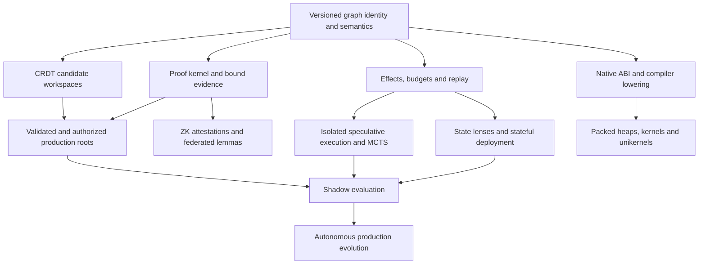

# Aether v4 readiness review against the built v1

Reviewed 2026-09-22. Baseline: `GhostlyGawd/swarm-experiment`, `main`, commit `3c3c8ebe63078f104f1ab7d8182b088124e9b1c6`. The local checkout matched GitHub's remote `main` and was clean before this review.

Sources: [built v1 PRD](PRD.md), [completed v1 roadmap](ROADMAP.md), source and tests at that commit, and the supplied [v4.0 PRD](PRD-v4.0.md). The v4 copy is byte-identical to the supplied file; SHA-256: `82cadd47583b7abff072f5acc7c3f73801008860a0310956da3859e62f9b37ed`.

## Assessment

**Keep the existing implementation as the foundation. Prepare an executable v4 specification before expanding it.** The proposed direction extends the repository coherently, but the document does not yet define a buildable, testable meaning of full v4 completion. It combines concrete engineering requirements, research objectives, universal safety claims, and hardware performance targets without specifying their operating conditions or failure behavior.

The baseline already goes beyond the original ten-feature v1: its subsequent roadmap records **62/62 items complete**, and **212 tests pass**. It includes durable storage, a richer language, incremental verification, governance utilities, framed agent sessions, projection tooling, and an executable topology model. Those assets are reusable. Their completion labels do not establish the stronger v4 guarantees.

Across the 40 v4 requirements, this review identifies **11 with direct functional foundations and 29 requiring a new subsystem**, sometimes with useful adjacent utilities already present. This is an implementation mapping, not an effort estimate or percentage complete. No blanket claim of v4 production compliance is supported by the current tests.

Two targeted probes also found baseline issues that should precede expansion: **state is lost during topology movement**, and **the claimed 4× token reduction is approximately 2.03× using the installed real tokenizer on the same example**.

This review adds documentation only. Proposed corrections and implementation work below have not been performed. The supplied PRD's “Approved” status is preserved as source text; it is not evidence that the decisions proposed here have been accepted.

## 1. What the baseline actually establishes

| Area | Reusable implementation | Boundary to preserve in planning |
|---|---|---|
| Graph repository | BLAKE3 addressing, canonical payloads, grouped child links, path copying, durable objects/roots/commits, provenance, mark-and-sweep, integrity checks, packfiles | Hash-index lookup at a small measured scale does not establish 100M-node capacity or latency. Physical object files remain an implementation detail. |
| Language | Records, nominal and fixed-width integers, results, sequences, closures, generics, imports, bounded quantifiers, ownership annotations, task/atomic nodes | This is a defined Aether language. It is not arbitrary TypeScript, Rust, Python, C++, GPU code, or a floating-point/tensor IR. |
| Semantics | Contract DSL, symbolic verification, bundled solver, external-solver adapter, proof-report cache, incremental invalidation, counterexamples | A cached report is not a proof certificate. An external solver adapter's presence does not establish portable proof checking or generalized invariant discovery. |
| Security/governance | Capability declarations/envelopes, runtime checks, sealed tokens, durable revocations, signed audit export, fence approval records | The runtime, embedding host, effect handlers, signing keys and storage form trust boundaries. No heterogeneous Byzantine consensus protocol exists. |
| Execution/search | Interpreter journal, checkpoints, heap forks, compiled JS execution, bounded synthesis, micro-worlds, schedule exploration | Forks copy record maps. Production execution omits the journal. No durable production replay or transactional external-effect broker exists. |
| Deployment/tuning | Capability-aware topology planning, separate per-unit runtime heaps, dispatch fault values, quiescent movement, telemetry, finite-difference tuning | Units execute within one Node process. Placement labels are not actual container/edge deployments. Stateful movement is defective. |
| Agent/human interfaces | Framed session operations, leases, compact textual IR, TypeScript projection/parser, LSP framing, structural diff | Agent frames contain encoded JSON. Python/Rust are incomplete output projections, with explicit placeholders. |

The README is behind the code in places: it says 160 tests and no runtime dependencies, while the current suite has 212 tests and `package.json` declares `js-tiktoken`. Update public claims as part of baseline preparation.

## 2. Findings that affect the build

### F1 — Stateful topology movement loses records

**Priority: fix before building fluid topology or shadow promotion.**

In [host.ts](../src/tier4/host.ts), `move()` at line 180 rebuilds both affected units. `rebuildUnit()` creates new `ProductionRuntime` instances without migrating their heaps, while `recordOwners` retains old ownership information. The current movement test checks placement and subsequent pure calls; it does not check state preservation.

Reproduced with the shipped ledger: allocate Alice with 100 cents and Bob with 0; transfer 10 successfully; move `transfer` to another existing unit. Alice reads as 90 before movement. After movement, reading her record throws `no record at @1`; another transfer fails with `no field balance at @1`.

Required gate: preserve reachable records, aliases, ownership and capability policy across movement, including state belonging to other functions in rebuilt units. Exercise successful migration, failed migration and rollback. Calls across units also need defined reference serialization/ownership; copying `{addr}` alone cannot establish shared state.

### F2 — The token-density acceptance test measures an estimator

**Priority: correct the metric before claiming the v4 ≥4× requirement.**

[agent-ir.ts](../src/tier1/agent-ir.ts) computes `bodyTokens` with `estimateTokens`; [nfr.bench.ts](../bench/nfr.bench.ts) and the density test compare against the same estimator. The installed real-tokenizer helper is tested independently but does not drive this acceptance test.

Using `buildLedgerExample()` and the existing `countTokens(..., 'cl100k_base')`:

| Measurement | TypeScript tokens | Agent-IR tokens | Compression |
|---|---:|---:|---:|
| Warm session, body only | 698 | 343 | **2.035×** |
| Warm session, complete messages | 698 | 375 | **1.861×** |
| Cold, complete module and dictionary | 878 | 933 | **0.941×** |

The legacy benchmark reports **4.23×** body compression using its estimator on this run. The real-tokenizer measurement applies to this fixture and encoding, not every model or codebase. It establishes that the existing test cannot substantiate the universal v4 claim.

Define separate wire-byte and model-context-token metrics, tokenizer identities, cold/warm session conditions, framing/dictionary costs, and a representative change corpus. Binary serialization alone does not define what tokens a synthesis model consumes. Preserve v1's explicit cold-versus-marginal distinction; v4 currently drops it.

### F3 — The distributed and concurrent behavior is still a local model

**Priority: define the consistency and deployment architecture first.**

[merge.ts](../src/tier1/merge.ts) implements three-way merging with explicit conflicts and a left-side result for contested slots. [persistence.ts](../src/tier1/persistence.ts) and [protocol.ts](../src/agent/protocol.ts) coordinate root updates and leases through filesystem locks. The 1,000-writer benchmark generates disjoint edits sequentially in one process and folds them together. It is useful structural-merge evidence, but does not test 1,000 connected replicas, overlapping edits, partitions, reordering or 50 ms convergence.

Similarly, [host.ts](../src/tier4/host.ts) calls local runtime instances. Cross-unit calls route through `call()`, while token verification and partition simulation live in `dispatch()`. Establish one enforced boundary for genuinely remote calls, with transport authentication, capability attenuation, idempotency, cancellation and retry semantics.

Tree replication needs explicit occurrence identities distinct from immutable subtree hashes: the same content can appear under multiple parents. Specify insert/delete/move/replace operations, cycle prevention, causal delivery assumptions, tombstone stability and how semantically invalid converged drafts are quarantined. Concurrent tree moves require a concrete algorithm; Lamport ordering and fractional positions alone are not a correctness argument. See the primary [replicated-tree move paper](https://martin.kleppmann.com/papers/move-op.pdf).

Recommended separation: replicated candidate workspaces may converge without waiting for approval; production roots advance only after validation and authorization of the exact resulting root. Independently valid edits can compose into an invalid program.

### F4 — Rewind, speculative execution and fallbacks need external-effect semantics

**Priority: prerequisite for FR-3.2, FR-3.4, FR-3.7 and FR-4.4.**

[runtime.ts](../src/tier3/runtime.ts) restores heap/environment deltas; `fork()` copies heap record maps and reuses the same runtime options, including effect handlers. The journal's push/pop undo cases do not reconstruct suspended executable continuations. Effect log entries contain calls and arguments, not a durable replay record of all returned values. [compile.ts](../src/tier3/compile.ts) intentionally strips the development journal.

A heap rollback does not undo a database append, a sent request, or a charged inference call. Re-running a failed candidate or shadow branch therefore needs a defined effect broker: record nondeterministic inputs/results, buffer or suppress speculative writes, attach idempotency keys, and commit effects once. Nontransactional effects need explicit compensation or a terminal abort policy.

Specify whether “time travel” restores logical heap state, resumable VM state, or native register state. These are different obligations. GPU execution, JIT compilation and topology changes also require an explicit determinism scope. A current heap fork cannot be counted as zero-copy execution continuation cloning or atomic branch promotion.

### F5 — Invariant synthesis must preserve intent and prove induction

**Priority: define the proof obligations before implementation.**

The repository has counterexample-guided **implementation** synthesis in [enumerative.ts](../src/synthesis/enumerative.ts), plus a limited monotone-loop variant inference routine. That does not implement FR-2.3's general discovery of inductive invariants.

The displayed v4 formula `Pre(x) ⇒ Post(f(x))` is an input/output property. A loop-invariant feature also needs initiation, preservation through a transition, and implication of the required postcondition at exit; termination is a separate obligation. Candidate contracts must not be weakened until buggy code passes. Keep user-authorized intent fixed, expose inferred auxiliary invariants separately, and require an explicit intent revision when needed.

Define grammar, theory fragment, candidate budget and `unknown`/timeout/no-solution outcomes. The existing CEGIS mechanism is a useful foundation, as described in Solar-Lezama's [CEGIS account](https://people.csail.mit.edu/asolar/SynthesisCourse2020/Lecture10.htm); it does not imply discovery of the user's desired specification.

### F6 — Proof evidence, cryptographic approval and zero knowledge need distinct contracts

**Priority: prerequisite for autonomous promotion and third-party execution.**

Current proof reports and `DischargeProof` records bind verification evidence to code, but there is no small independent LF-style proof kernel. Ed25519 audit exports and HMAC capability tokens are not threshold signatures or a Byzantine state-machine protocol.

For FR-2.6, specify validator identities, membership changes, family constraints, quorum intersection, equivocation handling, signing rounds, timeouts, key custody and stale-signature rejection. `n ≥ 3f + 1` alone is insufficient; the protocol and timing assumptions matter. Diverse model families do not establish statistically independent failures. The underlying distinction is demonstrated by [Practical Byzantine Fault Tolerance](https://www.usenix.org/conference/osdi-99/practical-byzantine-fault-tolerance).

For FR-2.9/2.10, bind a proof to the AST hash, contract/spec version, dependency closure, semantics/compiler version, target artifact hash, allowed capabilities and relevant assumptions. Define certificate size/depth limits and adversarial checker behavior. A zero-knowledge proof needs a precise statement and private witness; a proof of one execution is not automatically a proof of safety for all inputs. Existing zkVM documentation explicitly describes receipts for correct computation; see [RISC Zero's execution-proof model](https://github.com/risc0/risc0).

Move the proof format and checker design earlier than the PRD's final phase. The earlier lifecycle already depends on them. Keep universal “zero leaks” and `Pr[Escape] = 0` claims scoped to a stated semantics and trusted computing base; compiler, host, driver and effect-adapter correctness cannot be assumed away.

### F7 — State lenses are not arbitrary bijective schema migrations

**Priority: define supported schema transformations.**

The PRD gives the standard GetPut/PutGet round-trip laws but calls them a bijection. A lens may retain information in the old source that its view does not expose; its `put` receives that old source for a reason. The original [lens formalization](https://www.cis.upenn.edu/~bcpierce/papers/lenses-full.pdf) is the appropriate basis.

Example: projecting `{name, email}` into `{name}` can preserve `email` through the source passed to `put`; this is not a bijection between the two visible schemas. Conversely, a freely editable new field cannot always be represented in the old schema without complement storage, restrictions or a new representation.

Define the supported migration grammar, defaults/complements, rejected changes, mixed-version writes, concurrency, indexes, constraints and rollback. Lenses alone do not specify a database concurrency or physical migration protocol. Add a real persistence adapter before claiming the ≤3.5% SQL overhead target.

### F8 — Projection and hardware semantics need an explicit compatibility model

**Priority: decide before adding AST kinds or compiler backends.**

[coverage.ts](../src/projection/coverage.ts) labels all TypeScript kinds bidirectional, but only a subset of Python/Rust kinds as native; the remainder are placeholders. Neither language has a corresponding input parser. The current Python emitter also maps integer division to `//`, unlike the Aether runtime's truncation toward zero for negative operands, and stringifies boolean literals as lowercase JavaScript booleans. A function-name test cannot establish semantic fidelity.

Define whether the human views are editable projections of Aether's supported language subset or imports of unrestricted host-language programs. Specify round-trip identity separately from target-language execution equivalence and lossless preservation of contracts, provenance and capabilities.

The current `Ty` union has no floating-point/tensor types, explicit byte-buffer/pointer model, geometric constraints or low-level accelerator IR. SIMD/SPIR-V, differentiable search, LoRA, packed heaps and unikernels need shared numerical semantics, overflow/rounding rules, ABI and lowering contracts. Choose backend boundaries while retaining the TypeScript implementation as an executable semantic reference.

### F9 — Several absolutes are not usable acceptance criteria

**Priority: convert each into a bounded, measurable claim.**

Examples include “zero-cost” branch/reset operations, “zero cache-line thrashing,” “100% verified,” elimination of all visual bugs, and all-layout compile-time correctness from linear constraints. The document also says “the runtime forces a compile-time branch” on budget exhaustion: that should specify a statically required fallback edge selected at runtime.

Cassowary can govern a geometric model, but text shaping, content, viewport states, accessibility semantics and rendering need their own checks. Persona simulations need a browser/accessibility adapter and calibrated metrics; synthetic results cannot by themselves establish actual human task times or cognitive effort. Multimodal extraction needs uncertainty and ambiguity handling, not unconditional faithful compilation claims.

Treat these as requirements needing operational definitions. Do not silently remove them, substitute a simulation and mark them complete, or promise the SLA before measuring it. Governance export should specify the evidence and control mappings it produces rather than claiming that a signed ledger alone satisfies named compliance regimes.

### F10 — The lifecycle, phase plan and version labels need reconciliation

**Priority: prepare a dependency-based plan before estimating completion.**

The source supplies v4 and four calendar phases, but no separate v2/v3 acceptance specifications. Its earlier lifecycle uses proof certificates, scratchpads, specialized agents and learned adapters before several of those are scheduled for delivery. Phase 1 requires legacy binary lifting before the memory/ABI model is specified. State-preserving deployment and replay depend on effect isolation that has no explicit work item.

Several functional requirements are missing or ambiguous in the phase bullets, including the hybrid index, semantic GC, topological role induction, metamorphic synthesis, historical replay and gradient fuzzing. Every one of the 40 requirements needs an explicit owner stage and evidence gate. The 2027–2029 calendar and 24-month duration are planning assertions without staffing, infrastructure or research estimates.

## 3. Requirement-by-requirement mapping

**Foundation** means a directly reusable implementation exists, but the stated v4 scope still requires work. **New** means the named subsystem is absent; the evidence column may identify adjacent utilities. “Acceptance evidence” describes a minimum functional gate, in addition to the applicable NFRs.

### Tier 1 — 3 foundations, 8 new subsystems

| v4 ID | State and v1 evidence | Work and acceptance evidence required |
|---|---|---|
| FR-1.1 AST persistence | **Foundation:** `tier1/store.ts`, `repository.ts`, `canonical.ts`, `blake3.ts` | Version canonical encoding and migration rules; preserve deduplication/identity through extensions; validate capacity and durable retrieval at 100M nodes. |
| FR-1.2 IR and projection | **Foundation:** `tier1/agent-ir.ts`, `projection/*`, `agent/protocol.ts` | Specify binary wire/model interfaces; real-tokenizer corpus evidence; complete Rust/Python parsing and semantic round trips for every supported kind. |
| FR-1.3 lineage/fences | **Foundation:** `tier1/provenance.ts` | Make every production artifact causally attributable; define inherited provenance for shared expressions; prove invalidation and authorization bind to exact replacement/dependency versions. |
| FR-1.4 hybrid index | **New:** structural-key index exists | Add vector model/version management, creation/backfill, typed structural filtering and hybrid queries; measure recall, latency, storage cost and stale-index behavior. |
| FR-1.5 semantic GC | **New:** repository mark-and-sweep only | Add observable-behavior-preserving rewrite proposals, reachability/export policy, verification and rollback; distinguish dead-object deletion from dead-code simplification and CRDT tombstone GC. |
| FR-1.6 Tree-CRDT | **New:** `merge3`, CAS and leases are adjacent | Specify replicated occurrence/operation model; test convergence under duplicate/reordered operations, overlapping edits, moves, deletion, partitions and causal GC. |
| FR-1.7 module LoRA | **New:** no training/inference integration | Version base-model/adapter compatibility, verified training data, budget and evaluation provenance; demonstrate actual adapter training/loading and held-out benefit without regressions. |
| FR-1.8 binary lifting | **New:** pure capability envelope only | Define supported Wasm/LLVM/C++ subset and sound opaque fallback; test imported semantics, inferred effects and isolation against malicious memory access. |
| FR-1.9 scratchpads | **New:** synthesis feedback/provenance are adjacent | Add typed claims, decisions, hypotheses, task states and evidence links, with access control and retention. Version metadata separately from executable identity where appropriate. |
| FR-1.10 federated lemmas | **New:** no federation or ZK mechanism | Define rewrite language, assumptions and privacy statement; reject invalid/replayed/inapplicable proofs; demonstrate cross-repository reuse with the stated disclosure boundary. |
| FR-1.11 role induction | **New:** call-graph extraction exists | Cluster dependencies and mutations, allocate bounded tasks/contexts and adapters, and prevent conflicting ownership. Demonstrate useful specialization and rebalancing under churn. |

### Tier 2 — 3 foundations, 9 new subsystems

| v4 ID | State and v1 evidence | Work and acceptance evidence required |
|---|---|---|
| FR-2.1 executable specs | **Foundation:** `tier2/spec.ts` compiles a formal DSL and layer artifacts | Define natural-language-to-DSL boundary and relational fragment; demonstrate one versioned rule enforced by an actual client, API and database with coordinated rollout. |
| FR-2.2 disposable bodies | **Foundation:** `synthesis/loop.ts`, `verify.ts`, `purgeBody` | Integrate production faults with durable repair scheduling and safe replacement. Current purge/synthesis utilities are not an automatic production repair supervisor. |
| FR-2.3 invariant CEGIS | **New:** implementation CEGIS and limited variant inference exist | Add invariant candidate grammar, initiation/preservation/exit obligations, counterexample refinement and bounded failure outcomes; preserve authorized intent. |
| FR-2.4 OCap | **Foundation:** `ocap.ts`, `typecheck.ts`, both runtimes | Extend authority enforcement across real process/FFI boundaries; specify token passing/consumption, revocation epochs and trusted adapters; verify every effect path. |
| FR-2.5 economic types | **New:** step/solver/search limits are adjacent | Add linear budget split/reserve/consume/refund semantics and runtime metering; test recursion, concurrent forks, retries and exhaustion without double spending. |
| FR-2.6 Byzantine quorum | **New:** signed audit/approval utilities exist | Implement identity, heterogeneous eligibility, threshold signing and the chosen consensus/promotion protocol; test faulty/offline/equivocating evaluators and membership changes. |
| FR-2.7 state lenses | **New:** no application database lens engine | Generate lawful supported lenses, retain complements where needed, and handle mixed-version concurrent writes and rollback; measure actual SQL overhead. |
| FR-2.8 ambiguity probes | **New:** shrinking/counterexamples are adjacent | Define competing behaviors, minimality measure and bounded search; persist the governor's selection as a spec revision and invalidate affected artifacts. |
| FR-2.9 ZK attestation | **New:** no prover/verifier | Define committed artifact, capability/safety statement, witness and proving system; bind proof to executed binary and measure proving plus verification costs. |
| FR-2.10 proof-carrying AST | **New:** proof-report cache exists | Build certificate generator and independent checker for a declared calculus/fragment; reject forged, stale and oversized proofs; measure ≤50 µs on bounded certificates. |
| FR-2.11 metamorphic synthesis | **New:** predefined micro-world properties exist | Synthesize relations from a defined grammar, validate them against evidence, and show they detect known faults without declaring a faulty system correct through circular inference. |
| FR-2.12 multimodal intent | **New:** no design/video/heatmap ingestion | Build versioned source adapters, constraint/state extraction, uncertainty reporting and provenance; compare extracted behaviors with labeled fixtures. |

### Tier 3 — 3 foundations, 9 new subsystems

| v4 ID | State and v1 evidence | Work and acceptance evidence required |
|---|---|---|
| FR-3.1 reversible runtime | **Foundation:** `tier3/runtime.ts` | Define resumable state and production instrumentation; restore frames, scheduler state and recorded nondeterminism across process restart; prove logical replay equivalence. |
| FR-3.2 MCTS heaps | **Foundation:** heap fork and candidate verification | Implement copy-on-write state, search tree/selection/backpropagation, independent effect sandboxes and atomic winning-branch promotion; benchmark allocation and fork cost. |
| FR-3.3 micro-worlds | **Foundation:** `microworld.ts`, `generate.ts`, regression cases | Expand modeled faults and real scheduler exploration; define “100% survival” over a named campaign and measure throughput/coverage on meaningful workloads. |
| FR-3.4 historical replay | **New:** local trace and deterministic RNG are adjacent | Persist bitemporal events, code/state versions and effect results; replay an injected event fault with measured divergence and zero writes to live sinks. |
| FR-3.5 polyhedral kernels | **New:** no native compiler backend | Add affine loop/array IR, dependence legality, target lowering and equivalence checks; run real Wasm SIMD/SPIR-V kernels against defined baselines. |
| FR-3.6 differentiable AST | **New:** discrete enumerative synthesis exists | Define relaxable sublanguage/loss and gradient path; discretize and reverify candidates; compare quality and compute budget against enumerative/MCTS search. |
| FR-3.7 fallback trees | **New:** fault values, atomic blocks and synthesis fallback candidates are adjacent | Add typed three-level fallback AST/control flow, state/effect rollback and repair notification; test violations at every level, terminal abort and target-specific latency. |
| FR-3.8 spatial UI | **New:** no layout/rendering substrate | Add constraint AST, incremental solver, priorities and renderer; detect modeled contradictions and verify rendered responsive behavior and text/content cases. |
| FR-3.9 persona flocks | **New:** no user-flow/accessibility harness | Execute tasks against actual interfaces and accessibility trees; define persona inputs and metric calibration; validate keyboard/screen-reader and constrained-network cases. |
| FR-3.10 packed heaps | **New:** fixed-width arithmetic exists; heap uses JS Maps | Specify bounded representation/overflow, offsets, aliasing and ABI; test pack/unpack equivalence, mutation and migration; measure locality rather than asserting zero thrashing. |
| FR-3.11 gradient fuzzing | **New:** boundary-biased random generation exists | Instrument branch distances, define differentiation/search for supported guards and discrete fallbacks, and demonstrate deeper coverage under equal budgets. |
| FR-3.12 Bayesian risk | **New:** telemetry and lineage are adjacent | Define failure labels, priors, calibration, uncertainty and drift; validate predictions on held-out history; route proposed changes through existing verification/promotion gates. |

### Tier 4 — 2 foundations, 3 new subsystems

| v4 ID | State and v1 evidence | Work and acceptance evidence required |
|---|---|---|
| FR-4.1 fluid topology | **Foundation:** `topology.ts`, `host.ts` | Repair state movement; build real deployment adapters, sovereignty policy and state/effect transfer; test cross-process migration, failure and rollback under load. |
| FR-4.2 negotiated protocols | **New:** framed agent JSON and wire request types exist | Add measured field distributions, safe codec generation, authenticated negotiation, epoch/version overlap and downgrade behavior; test mixed-version, malformed and out-of-range data. |
| FR-4.3 optimization surfaces | **Foundation:** `surfaces.ts` finite-difference tuner | Connect live telemetry and safe root promotion; specify multi-parameter objective/constraints, measurement noise and stability; prove only permitted parameters change. |
| FR-4.4 shadow evolution | **New:** topology and micro-world utilities exist | Mirror ingress into effect-isolated candidates; define statistical confidence, correctness tolerances and promotion/rollback rules; demonstrate no duplicate external effects. |
| FR-4.5 unikernels | **New:** JS production compiler only | Choose architecture/hypervisor/driver set and supported language subset; emit and boot real images; measure image/resident memory and defined cold-start endpoint. |

Version requirement IDs when building the new tracker. In particular, v1 `FR-2.3` maps to v4 `FR-2.4`; v1 `FR-3.2` maps to v4 `FR-3.3`; and v1 `FR-4.2` maps to v4 `FR-4.3`. The other seven original functional IDs retain their corresponding feature numbers. Do not reinterpret old tests under the new IDs.

## 4. Performance claims and required measurement changes

The current benchmark exited successfully with **9 met, 2 qualified, 0 missed against its own v1 checks**. It does not run the v4 acceptance profile.

| v4 target | Evidence from this review | Required qualification or next measurement |
|---|---|---|
| Retrieval ≤2 ms at 100M nodes | In-memory p99.9 0.0027 ms at 762,500 nodes; durable p99.9 0.5662 ms on 5,000 roots | Specify hardware, node sizes, working set, cold/warm cache, index memory, durability and mixed read/write load. No 100M result exists. |
| 1,000-agent convergence ≤50 ms | Disjoint local edits survive; 1,005 ms generation and 1,185 ms reconciliation in this run | This is a different operation, not a comparable CRDT SLA test. Define topology, partition recovery and percentile. |
| Heap rollback ≤5 ms | Worst 0.13 ms for 250 local ledger transfers | Positive result for this fixture only; measure state size, task/continuation restoration and durable replay separately. |
| Fallback ≤50 ns | No runtime fallback cascade | Specify whether only branch selection or detection, rollback and fallback startup are included; measure on the intended native target. |
| Proof check ≤50 µs | No independent certificate checker | Bound calculus, certificate size/depth, hardware and warmup; report checker time separately from proof generation. |
| Unikernel ≤1 ms, ≤2 MB | No image compiler/boot harness | Define host/hypervisor, drivers, loaded image versus resident footprint, and boot-to-first-useful-response endpoint. |
| Lenses ≤3.5% SQL overhead | No database lens adapter | Define workload, schema changes, cache, concurrency and whether translation, network and query time are included. |
| SMT hard cutoff ≤1,500 ms | Current default is 2,000 ms; worst ledger query 3 ms | Reduce the configured limit and verify cancellation/preemption under difficult queries. Easy queries do not test a hard cutoff. |
| Projection ≥75,000 lines/sec | No matching benchmark | Define line accounting, target language, parser versus emitter, increment size and preservation checks. |
| ZK verification ≤5 ms | No ZK backend | Specify proof system, security parameters, statement size, setup and hardware; include proving cost separately. |
| Agent-IR ≥4× token advantage | Real tokenizer: 2.035× body / 1.861× warm message / 0.941× cold | Adopt actual tokenizer/corpus measurements; retain full-session costs alongside marginal costs. |
| Figma-to-AST ≤400 ms | No multimodal pipeline | Define local/network fetch boundary, design size and extraction quality/error handling. |

Additional observed v1 results: micro-world suite 55 ms across four declarations (29 ms worst declaration), identical heap/trace across three deterministic runs, and compiled execution 9.4× faster than the interpreter on 20,000 calls. These measurements are machine/workload observations, not universal guarantees.

The KPI baselines and targets also need experimental definitions: feature size and baseline population for ≤10-minute completion; all input/output/training/retry tokens for context savings; denominator and observation window for regressions; and confidence/constraints for Pareto dominance. A 4× representation improvement corresponds to 75% savings, so it does not alone establish the separate 80–82% total-context target. Finite fuzz campaigns and three successful replays do not establish a universal absence of regressions.

## 5. Architecture contracts to settle during preparation

These are proposed decisions to record as ADRs, not requests to stop the review for approval.

1. **Identity and metadata.** Preserve canonical executable hashes. Define versioned links for provenance, embeddings, adapter weights, scratchpads, telemetry and certificates. Decide what changes semantic identity versus merely invalidates a derived artifact; avoid rewriting all code hashes for every telemetry sample.
2. **Replication and promotion.** Define occurrence IDs, CRDT operations and candidate branches separately from the approved production root. Sign the final candidate plus dependency/spec versions; revalidate after composition and reject stale promotions.
3. **Machine and numerical semantics.** Define arithmetic, ownership, scheduler, heap/reference model, ABI and supported language projections. Keep a reference implementation and use differential conformance tests for every native/accelerator backend.
4. **Effects, budgets and state.** Introduce one effect interface covering identity, authorization, metering, replay, speculative suppression, commit, retry and cancellation. Specify both linear budget ownership and runtime debiting across forks/services.
5. **Evidence and trust.** Define proof calculus and supported fragments, checker TCB, attestation statement, evaluator protocol and key management. Distinguish formal proof, property evidence, statistical evidence and human-approved exceptions in the promotion policy.
6. **Runtime integrations.** Select initial database, process transport, native target and model/training adapter using bounded technical spikes. Record compatibility/version contracts before committing to general LLVM/C++ lifting or bare-metal coverage.
7. **Benchmark and completion policy.** Keep every original FR/NFR visible. An unsupported target, simulated backend or unproven performance threshold remains incomplete unless the requirement is explicitly revised. Define named workloads and failure injection for every gate.

## 6. Proposed route from the current baseline to full v4

The labels below are proposed release milestones, since the supplied PRD does not define v2/v3. They reorder prerequisites while retaining all 40 requirements. Early slices of a feature do not count as full completion; hardware and scale gates may close later.

| Milestone | Scope and requirement ownership | Exit evidence |
|---|---|---|
| **Baseline repair and specification** | Fix F1; replace estimator-based acceptance; document projection/runtime boundaries; resolve the seven ADRs; create a versioned 40-FR/NFR tracker | Stateful movement regression passes; real token report published; every requirement has dependencies, target scope and an executable gate. |
| **v2 — trustworthy collaborative runtime** | Extend FR-1.1/1.2/1.3, FR-2.1/2.2/2.4 and FR-3.1/3.3. Add FR-1.4/1.6/1.9, FR-2.3/2.5/2.6/2.7/2.8/2.10, FR-3.4/3.7. Establish process transport, effect isolation and proof kernel | Two independent processes edit, verify and promote a candidate; restart/replay and state migration preserve behavior; budgets, revocation, stale proofs and invalid merged candidates are enforced. |
| **v3 — autonomous application evolution** | FR-1.5/1.7/1.11; FR-2.11/2.12; FR-3.2/3.8/3.9/3.11/3.12; FR-4.1/4.3/4.4. Couple search, learned context, interfaces and production telemetry through the v2 gates | A persistent application accepts a spec change, resolves ambiguity, explores isolated candidates, verifies an interface and data evolution, shadows traffic, promotes safely and rolls back correctly. |
| **v4 — hardware, confidential exchange and scale closure** | FR-1.8/1.10; FR-2.9; FR-3.5/3.6/3.10; FR-4.2/4.5. Close all outstanding earlier FR details and every NFR/KPI gate | Real imported binaries, accelerator kernels, negotiated codecs, ZK attestations and bootable unikernels; measured 100M-node/1,000-agent runs; reproducible end-to-end evidence for all 40 requirements. |

Run bounded feasibility experiments for the last milestone during preparation: native fallback timing, unikernel boot, certificate checking, ZK statements and differentiable search can materially alter the architecture. Early research does not authorize calling prototypes complete or guarantee the document's calendar.

The principal dependencies are:



### Recommended first vertical slice

Use the existing ledger as an integration fixture, followed by a workflow/UI fixture and a numerical-kernel fixture so ledger arithmetic does not become the only success criterion.

1. Preserve ledger state during unit movement and reject stale code/proof dependencies.
2. Run two genuine processes over an authenticated capability boundary, with deterministic recorded effects.
3. Add one bounded economic capability and one safe fallback path; exercise timeout, revocation and exhausted budgets.
4. Replicate overlapping candidate edits, then verify and authorize the resulting exact root before promotion.
5. Restart, replay and shadow the change; demonstrate no duplicate ledger appends and a successful rollback.

This first slice tests the substrate on which the remaining research features rely. It also makes the next build plan concrete without attempting to implement all forty features simultaneously.

## 7. Verification record and reproducibility

Environment: Node `v26.7.0`, local `arm64` host. Commands run against the baseline:

- `git ls-remote origin refs/heads/main`: matched the reviewed commit.
- `npm test`: build succeeded; 212 passed, 0 failed, 0 skipped.
- `npm run typecheck`: passed.
- `npm run roadmap:check`: passed; generated v1 roadmap current.
- `npm run bench`: exited 0; 9 met, 2 qualified, 0 missed under v1's benchmark definitions.
- Targeted token and movement probes: results recorded in F1/F2; neither is covered by the current acceptance suite.

The token probe uses the existing exported API:

```js
const ex = buildLedgerExample();
const context = new IrContext();
encode(ex.module, context); // warm the shared dictionary
let ts = 0, body = 0, messages = 0;
for (const fn of ex.module.members.filter(n => n.kind === 'FunctionDecl')) {
  const ir = encode(fn, context);
  ts += countTokens(projectTypeScript(fn, ex.syms, {}));
  body += countTokens(ir.body);
  messages += countTokens(ir.text);
}
// ts=698, body=343, messages=375; countTokens defaults to cl100k_base.
```

For the movement probe, construct `TopologyHost` from `buildLedgerExample`, `ledgerTelemetry` and `slice`; allocate two `ACCOUNT` records; call `transfer`; choose any different unit in `host.plan.units`; call `host.move(transfer, target)`; then read and transfer against the same references. This reproduces the state-loss failure reported above.

This was a requirements/readiness review with source inspection and targeted probes. It was not a complete verifier soundness audit, a distributed security audit, or a test at the proposed production scale. Passing baseline checks remain useful evidence within their measured scope.
