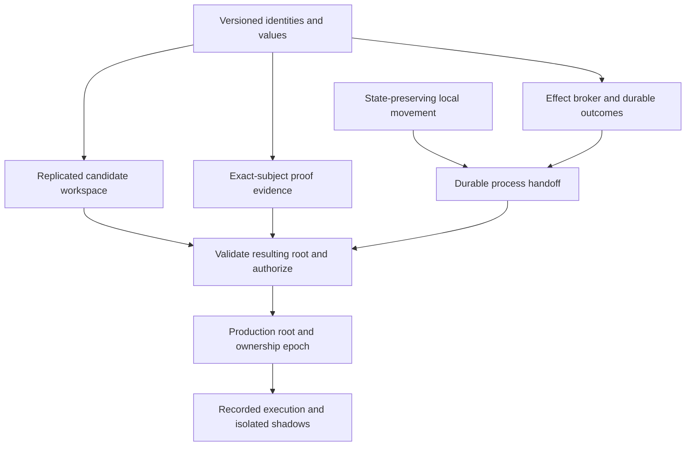

# Aether v4 implementation specification

| Field | Value |
|---|---|
| Specification version | **0.1.0** |
| Date | 2026-09-22 |
| Status | Implementation baseline for the first slice; later research choices remain gated |
| Target product | Aether v4.0; this document version does not change the npm package version |
| Reviewed code | `3c3c8ebe63078f104f1ab7d8182b088124e9b1c6` |
| Source requirements | [Preserved v4 PRD](../../PRD-v4.0.md) |
| Findings | [Readiness review](../../V4-READINESS-REVIEW.md) |
| Executable plan | [plan.ts](../../../roadmap/v4/plan.ts) |
| Generated tracker | [TRACKER.md](TRACKER.md) |

## 1. Scope and interpretation

This specification defines the contracts and verification obligations for extending the current implementation through all 40 v4 functional requirements. The tracker also preserves 16 nonfunctional obligations, three governance obligations and 12 KPI statements from the source. Repeated KPI targets remain traceable to their original source statements.

The first implementation slice is state preservation, truthful measurement, versioned identities, effects, replication envelopes, proof validation, durable process handoff and exact-root admission. Its eight tasks are detailed below. The tracker contains deliverables and acceptance gates for every later feature and release milestone.

**MUST** and **MUST NOT** are implementation requirements. Code sketches specify proposed interfaces; they are not implemented APIs. Existing functionality does not earn a v4 completion mark automatically. Runtime work begins as `planned`, including the confirmed state-preservation and benchmark corrections.

Keep the original v1 PRD/roadmap and the supplied v4 PRD intact. Use versioned IDs (`V4-FR-2.4`, for example) to avoid collisions with v1 requirement numbers. The proposed v2/v3 milestones describe staged delivery; they are not claims that independent v2/v3 PRDs exist. The source calendar is not a staffed delivery estimate.

### Completion and change control

- A task is `verified` only after every named gate passes with repository-local evidence for this specification version and an exact subject commit.
- Dependencies are prerequisites for closing a task. Exploration may start earlier; a prototype does not satisfy a dependent production gate.
- A feature task establishes functional delivery. Its applicable assurance tasks must also pass before full v4 completion.
- An unsupported backend, missing benchmark, failed target, unproved safety statement or unresolved research decision remains incomplete. A waiver cannot turn it into a pass.
- `planned → in_progress → verified` is the normal lifecycle. `blocked` requires a concrete reason. A failed gate returns work to `in_progress`; changes invalidating evidence reopen the task and its affected dependents.
- Patch specification changes clarify text; minor changes add compatible obligations; major changes alter identity, protocol or safety semantics. Any criteria change requires a changelog entry, tracker regeneration and review of existing evidence. The validator conservatively requires the current exact spec version for verified work.

The graph validator checks structure, coverage, prerequisite state and evidence metadata. It cannot establish that a stored test log is truthful or that a formal proof is sound; those remain the responsibility of the named verification process.

## 2. Architecture and ownership

| Boundary | Responsibility | Existing starting point |
|---|---|---|
| Substrate | Immutable executable objects; versioned roots, manifests and metadata | `src/tier1/{store,repository,canonical,provenance}.ts` |
| Language | Canonical value/type semantics; projections and lowering | `src/tier1/ast.ts`, `src/projection/*` |
| Runtime | State ownership, snapshots, task lifecycle and effects | `src/tier3/{runtime,compile,values}.ts` |
| Distribution | Candidate replication, authenticated calls, migration | `src/agent/protocol.ts`, `src/tier4/host.ts` |
| Verification | Exact-subject evidence, independent proof checks, admission policy | `src/tier2/{verify,incremental,proof-cache}.ts` |
| Governance | Promotion authorization, quorum, revocation and audit | `src/tier1/provenance.ts`, `src/tier2/ocap.ts` |
| Measurement | Workload manifests, raw results, target evaluation | `bench/nfr.bench.ts`, `src/util/tokens.ts` |

These are module/discipline owners, not assigned people or autonomous agent appointments. The TypeScript implementation remains the reference semantics. Native, UI, database and model adapters must expose explicit conformance boundaries. Internal implementation files may remain ordinary filesystem files; executable graph identity cannot depend on their paths.



## 3. C1 — Executable identity, state identity and encoding

Owner task: **V4-F03**. Implementations must agree on the following identities before transmitting state, effects, votes or proof evidence.

```ts
type Digest = string; // validated algorithm/domain prefix + full digest
interface ExecutionManifestV1 {
  format: 'aether.execution/1';
  astRoot: Digest;
  specRoot: Digest;
  dependencies: ReadonlyArray<{ symbol: string; declaration: Digest }>;
  semanticsVersion: string;
  compilerDigest: Digest;
  target: { abiVersion: string; profileDigest: Digest; artifactDigest: Digest };
  capabilityPolicyDigest: Digest;
  evidencePolicyDigest: Digest;
}
interface LogicalRefV1 {
  heapId: string;
  objectId: string;
  ownerEpoch: string; // integer decimal string; routing authority, not object identity
}
```

1. Canonical executable payloads retain the current v1 hash rules. Any incompatible encoding uses a new domain/version and explicit migration; opening a repository must never rehash its objects silently.
2. The complete execution-manifest digest binds code, specification, dependency declarations, semantics, compiler, ABI, target artifact and policy. Dependency order is canonical by symbol; duplicates are invalid. Transitive dependency closure is included, including imported modules and external summaries used in verification.
3. Embeddings, adapter weights, telemetry, scratchpads and proof attempts use separately versioned metadata references. Updating an observation does not change executable identity. Selecting a different synthesis adapter changes the synthesis record; changing produced code changes its AST hash.
4. Content hashes identify values/subtrees; occurrence IDs identify their location in a replicated editable tree. Heap IDs/object IDs identify mutable records. These identities must not be interchanged.
5. Snapshot values use a tagged recursive format: null, bool, UTF-8 string, arbitrary-precision integer encoded as canonical decimal, immutable sequence, tagged result, and logical reference. Records live in a separate object table, so cycles and aliases remain references. Sort record fields and reject duplicates. Do not serialize bigint through JSON numbers.
6. Version 1 snapshots reject live JS closures, task callbacks, native pointers and opaque host resources unless an explicit versioned serializer exists. Rejection occurs before migration alters live state. Later resumable-task support adds validated code/environment/task descriptors, not executable JS text.
7. Protocol schemas define max frame bytes, object count, nesting depth, integer digits and decompressed size. Reject unknown versions, oversized inputs, invalid digests and malformed values before allocating unbounded memory or updating roots.
8. Secret keys and live capability bearer tokens are not ordinary heap fields. Serialize opaque authority references; destination adapters validate/reissue permitted grants against the current policy and epoch.

## 4. C2 — State preservation and migration

Owner tasks: **V4-F01** (local correctness), **V4-F07** (durable process handoff). Extended resumable state belongs to **V4-T3-01**.

### Local handoff contract

Introduce a validated `ProductionRuntime.exportSnapshot()` / `importSnapshot()` boundary and a transactional `TopologyHost.move()` operation. Preserve the current synchronous public behavior for the initial local repair. The first patch must repair the actual data-loss defect without requiring CRDTs, native code or a distributed database.

F01 can use an internal in-memory snapshot over existing runtime values, bound to the current module root. It does not depend on the new C1 wire envelope. The serialized schema below is the F03/F07 extension; adopting it later must preserve the local repair's reference and rollback invariants.

```ts
interface RuntimeSnapshotV1 {
  format: 'aether.state/1';
  executionManifest: Digest;
  heapId: string;
  nextObjectId: string;
  records: ReadonlyArray<{ objectId: string; fields: ReadonlyArray<[string, unknown]> }>;
  ownership: ReadonlyArray<{ objectId: string; unit: string; epoch: string }>;
  eventCursor: string;
}
// `unknown` above is the validated TaggedValueV1 schema described in C1.
```

**Preconditions:** source and target exist; source/target affected units are quiescent; placement and capability constraints permit the move; no unsupported live value exists; expected plan generation matches. Moving to the current unit is a no-op that does not rebuild heaps or duplicate membership.

**Preparation:** freeze writes to the affected ownership set, capture authoritative record versions, compile candidate units off to the side, import/validate state, and verify every reference resolves. Export all records required by every rebuilt unit, including state used by functions that are not moving. Initially a conservative full snapshot is acceptable; optimization must retain the same behavior.

The current host duplicates allocations across unit heaps and tracks `recordOwners`. When preparing the local repair, resolve each record from its authoritative owner. Do not overwrite a newer authoritative record with an older duplicate from another unit. A conflict or dangling owner fails preparation. Preserve nested aliases and cycles and retain legacy numeric-reference translation within the local host. For real process boundaries, replace assumptions about aligned allocation addresses with C1 logical references and an explicit ownership map.

**Commit:** publish the new plan, runtime mapping and ownership mapping as one visible generation. No call may see a new placement with an old/empty heap. The allocator must resume above existing IDs. Cross-unit mutable access must route to the owner or participate in a declared transaction; passing a raw address is insufficient.

**Failure:** any error before publication leaves the old plan, records, allocator and capabilities usable. Release preparation locks/reservations on all paths. After publication, recovery follows the durable commit decision; it does not guess from which worker is alive. Existing telemetry history must survive runtime replacement.

### Durable migration protocol

Use `requested → prepared → committed → finalized` with durable migration ID, expected plan generation, affected owners, source/destination manifests and snapshot digests. `aborted` is terminal only before commit. In-progress calls drain or cancel at declared safe points; an external effect with unknown disposition blocks migration finalization until reconciled.

- `prepared`: snapshots and destination import validation are durable; source remains authoritative.
- `committed`: the coordinator persists the ownership/plan decision atomically. Destination may serve the new epoch; old-epoch mutations fail.
- `finalized`: destination acknowledgment and cleanup are recorded. Cleanup may be retried and must preserve retained replay snapshots.
- On restart, recover from the decision log. Do not elect a new writer from a timeout alone. During an unresolved partition, reject mutations rather than allowing two owners.

Local heap rollback cannot compensate arbitrary committed external effects. Code rollback after schema/state changes requires a compatible lens or recorded safe recovery path; otherwise the operation reports `rollback_unavailable` and preserves current data for recovery.

### Required state regression cases

The ledger must retain balances **90/10 after a 10-cent transfer and movement**, then accept another transfer correctly. Add nested/shared/cyclic references, unrelated functions in rebuilt units, new allocations, same-unit moves, invalid placement, active calls and injected snapshot/import/compile failures. The process handoff task additionally kills workers at each durable transition and retries the same migration ID.

## 5. C3 — Effects, budgets and replay

Owner task: **V4-F04**. Every interpreter, production, remote and imported-code effect adapter must eventually pass through this boundary. Direct host callback execution remains a legacy compatibility mode and cannot qualify for speculative/replay guarantees.

```ts
type ExecutionMode = 'live' | 'speculative' | 'shadow' | 'replay';
interface EffectRequestV1 {
  format: 'aether.effect/1';
  executionId: string;
  effectId: string;
  branchId: string | null;
  executionManifest: Digest;
  capabilityGrantRef: string;
  policyEpoch: string;
  payloadDigest: Digest;
  payload: unknown; // TaggedValueV1
  budgetReservationId: string | null;
  deadline: string; // broker clock domain declared in the execution profile
}
type EffectOutcome =
  | { state: 'committed'; receiptDigest: Digest; value: unknown }
  | { state: 'rejected' | 'aborted'; code: string }
  | { state: 'indeterminate'; recoveryId: string };
```

### Identity and outcomes

The coordinator allocates and persists an effect ID before dispatch. Retries of a logical effect reuse its ID and payload digest. A repeated ID with different bytes, manifest or authorization context is a conflict, not a second operation. Prepared speculative branches use local intent IDs; only the selected branch receives live commit IDs from the coordinator. Branch reset cannot erase committed receipts or monetary charges.

The durable broker state is `requested → reserved → prepared → committed`, with `rejected` or `aborted` possible before an irreversible commit. An uncertain dispatch produces `indeterminate`. Store the request, ordered input/result, observed event time, recorded time, grant/policy references and receipt before acknowledging durable success.

Adapters declare whether they support transactional prepare/commit, atomic sink idempotency, read-result recording or explicit reconciliation. At-most-one logical commit requires corresponding sink support; a local write-ahead log alone is insufficient when the process crashes after the sink acts but before the receipt is stored. Such a case is reconciled through the same effect ID. Never blindly retry an indeterminate non-idempotent operation, and never call it safely aborted.

### Modes

| Mode | Reads/nondeterminism | Writes |
|---|---|---|
| Live | Authorized broker reads; record clock/random/network results | Commit via declared adapter semantics and durable receipt |
| Speculative | Recorded inputs or isolated read snapshot; report unsupported access | Buffer intents or write to an isolated transaction; no live irreversible commit |
| Shadow | Mirrored request and isolated/recorded state | Isolated sink only; no production writes or production credentials |
| Replay | Consume exact recorded input/outcome sequence | Return recorded outcomes; never invoke a live sink |

Replay matching checks operation order, request identity, payload, manifest and policy context. Missing or mismatched events produce `replay_mismatch`. Historical policy records allow faithful isolated replay; they do not restore revoked authority for live calls. Nondeterminism introduced by time, random values, scheduler choices and external results must be captured or explicitly excluded from a target's conformance claim.

### Budgets and fallbacks

Budget resources are durable linear balances. Splitting creates disjoint reservations; consuming atomically debits a reservation; refunds cover only unused/uncommitted resources. Forks cannot clone balances. A timeout or heap rollback does not refund an already billed API call.

The language must require a declared exhaustion path; the runtime chooses it when the broker refuses a reservation or charge. This replaces the source's ambiguous “runtime forces a compile-time branch” wording with explicit compile-time structure and runtime selection. Fallback cannot regain a revoked capability or repeat an indeterminate effect. The initial broker exposes reservation hooks; full static economic typing remains **V4-T2-05**.

Required failures include payload-changing retries, denial before dispatch, crash after sink commit, receipt-store failure, cancellation races, stale revocations, branch abandonment, concurrent reservation exhaustion and replay mismatch.

## 6. C4 — Candidate replication and production consistency

Owner tasks: **V4-F05**, **V4-T1-06**, **V4-R01**. The first task supplies envelopes and a fault-injectable transport; it does not complete the Tree-CRDT algorithm.

```ts
interface MutationEnvelopeV1 {
  format: 'aether.mutation/1';
  repositoryId: string;
  membershipEpoch: string;
  replicaId: string; // bound to enrolled verification key
  sequence: string;
  lamport: string;
  causalFrontier: ReadonlyArray<[string, string]>;
  occurrenceId: string;
  operation: 'insert' | 'delete' | 'move' | 'replace';
  payloadDigest: Digest;
  payload: unknown; // operation-specific, versioned schema
  signature: string;
}
```

Replica IDs and sequence counters are durable; restarting cannot reuse an ID. Occurrence identity is stable through movement and distinct from its content hash. Child order, parent edge, executable replacement and tombstones have explicit operation schemas. A shared AST subtree may have multiple independent editable occurrences.

Ingestion MUST validate membership, signature, resource bounds, causal dependencies and operation payload hashes before application. Duplicate exact operations are idempotent. Conflicting payloads for one signed operation ID are evidence of equivocation, retained and quarantined deterministically; accepting the first arrival is not a valid conflict policy. Missing predecessors stay pending and are requested from peers. Invalid operations cannot corrupt an admitted root.

**Working direction for R01:** state-based union of immutable authenticated operation sets, with a deterministic projection into an occurrence tree and then immutable AST roots. Select and document the concrete move/cycle/deletion algorithm before claiming convergence. The merge must be associative, commutative and idempotent; final state must depend on the accepted operation set rather than arrival order. Lamport order and fractional child positions alone do not establish those properties.

R01 must settle concurrent move/delete/replace precedence, dangling-parent handling, fractional-position growth/rebalancing, same-ID equivocation, replica retirement and tombstone causal stability. Require a bounded executable model and adversarial convergence tests before **V4-T1-06** closes. Primary research context is retained in the [readiness review](../../V4-READINESS-REVIEW.md).

### Production boundary

Candidate replication is available independently of production authorization. Converging to a syntactically or semantically invalid candidate is permitted if it remains quarantined and inspectable. It never authorizes executing that candidate. Revalidate the composed AST, contracts, dependencies and effect policy after merging; proofs for the pre-merge inputs are insufficient.

Production advances by an authorized exact-root commit with a compare-and-swap on the expected parent and policy epoch. Early baseline admission uses an authenticated governor; full v2 admission requires the heterogeneous quorum protocol. This distinction must be visible in policy and release evidence.

The source's absence-of-lock-contention requirement applies to the declared candidate-mutation workload. Production authorization has an explicit consistency protocol. If the intended source claim also prohibits all production serialization, that is a requirements conflict to resolve in R01; do not silently count serialized promotion as proof of lock-free global mutation.

The convergence benchmark begins with the final declared mutation becoming eligible for delivery and ends when all participating nonfaulty replicas acknowledge the same root/frontier. A connected-network SLA and post-partition recovery are distinct profiles. No finite ≤50 ms promise is made during an unbounded partition. Actual 1,000-agent qualification remains **V4-Q01**.

## 7. C5 — Proof validation, authorization and admission

Owner tasks: **V4-F06**, **V4-F08**, **V4-T2-10**, **V4-T2-06**.

```ts
interface EvidenceEnvelopeV1 {
  format: 'aether.evidence/1';
  executionManifest: Digest;
  obligationSetDigest: Digest;
  assumptionsDigest: Digest;
  evidenceKind: 'local_solver' | 'certificate' | 'property_campaign';
  checker: { id: string; version: string; semanticsVersion: string };
  evidenceDigest: Digest;
  limits: { bytes: number; steps: number; depth: number };
}
interface PromotionProposalV1 {
  format: 'aether.promotion/1';
  repositoryId: string;
  expectedParent: Digest;
  candidateManifest: Digest;
  evidenceBundleDigest: Digest;
  migrationPlanDigest: Digest;
  effectPlanDigest: Digest;
  membershipEpoch: string;
  policyEpoch: string;
  expiresAt: string;
}
```

### Validation sequence

1. Validate canonical schema, supported version and size limits before decoding expensive evidence.
2. Recompute the candidate execution manifest and complete dependency closure. Resolve pinned external summaries and reject missing or changed dependencies.
3. Derive the expected obligation set from the candidate and policy. Require exactly one accounted-for result per obligation; truncated exploration, missing/duplicate obligations, frame violations and undeclared assumptions are not proof.
4. Verify evidence according to its kind. A local trusted verifier may produce solver evidence; an untrusted peer's JSON `proved` result is reverified, never accepted as authority. A cached report needs both valid subject binding and trusted provenance. A digest alone establishes neither.
5. Portable certificates are checked by a small bounded independent kernel against the exact goal and assumption environment. Checker timeout, unsupported calculus and excessive depth yield an explicit nonvalid result. Certificate generation/checking is **V4-T2-10**, not the report-envelope task.
6. Property campaigns satisfy only explicitly property-classified obligations. They cannot discharge a formal-required contract or justify formal proof elision. An exceptional human policy decision records scope and rationale but does not relabel an unproved clause as proved.
7. Check the current authorization, membership and revocation epoch immediately before the atomic admission point. Expired/stale approvals cannot be replayed for another root, target, migration or effect plan.

Preconditions remain enforced at entry boundaries unless caller obligations establish them under the same admitted dependency closure. No solver proof over an alias-free model may silently remove checks for aliased input. Proofs for language semantics do not automatically establish correctness of native lowering; either verify lowering or include the compiler in the declared TCB and provide conformance evidence.

### Promotion and recovery

Persist transitions `candidate → validated → authorized → prepared → active`. Validation binds the full proposal. Preparation creates isolated target state without serving traffic. The active transition is a durable compare-and-swap over parent root and ownership/policy generation. Any intervening edit or policy change requires revalidation/reauthorization. Retain the previous root and state/lens compatibility plan for rollback.

Rejected candidates retain diagnostic evidence but cannot affect live execution. Crashes recover from the durable decision; acknowledgment loss never creates two active owners. Revocation must be checked at invocation as well as promotion so long-lived code cannot retain obsolete authority. Partitions use a documented fail-closed freshness policy for new effects.

R01 defines quorum threshold, intersection, fault bound, rounds, view changes and membership transitions. Votes bind the complete proposal digest and epoch. Distinct model-family eligibility supplements cryptographic identity; it is not a proof that errors are independent. R03 defines the LF-style calculus and ZK statement, private witness, target binding and security assumptions. Universal module safety and a proof of one execution must not be conflated.

### Required proof/admission rejection matrix

| Change or defect | Required result |
|---|---|
| Body, spec, callee contract, imported dependency or target differs | Stale evidence; reverify |
| Semantics/compiler/ABI/policy differs | Incompatible evidence; reverify or verified compatibility translation |
| Missing obligation, path truncation, hidden assumption, frame violation | Reject formal admission and proof elision |
| Property-only success for formal-required contract | Keep unproved; reject that promotion policy |
| Forged/untrusted cached `proved` report | Reverify or reject |
| Invalid/oversized/timed-out portable certificate | Nonvalid result, no partial acceptance |
| Valid proof but stale root parent or expired/revoked authorization | Abort admission; preserve current production state |
| Simultaneous valid promotions from the same parent | At most one commits; the other must rebase, reverify and reauthorize |

## 8. C6 — Accurate benchmark and evidence contracts

Owner task: **V4-F02**. Source targets remain unchanged in the [tracker](TRACKER.md); workload/profile definitions determine what a measurement establishes.

```ts
interface BenchmarkRunV1 {
  format: 'aether.benchmark/1';
  specVersion: string;
  subjectCommit: string;
  workloadDigest: Digest;
  targetProfileDigest: Digest;
  environment: Record<string, string>; // OS, CPU, RAM, Node/backend, package versions
  seed: string;
  warmup: number;
  trials: number;
  samplesArtifact: string;
  measurements: Array<{
    requirement: string;
    metric: string;
    unit: string;
    value: number | null;
    verdict: 'pass' | 'fail' | 'not_measured' | 'inconclusive';
  }>;
}
```

### Token measurements

Pin tokenizer and package version and hash the input corpus. Use the actual tokenizer API for both TypeScript and IR. Keep the estimator only as a separately labeled diagnostic. Report:

- Cold module: complete projection versus complete IR plus dictionary and framing.
- Warm change: body-only diagnostic and complete message cost, with dictionary deltas included.
- Full session: initial context, all changes, repairs, failed attempts and responses. Report learned-adapter training/inference cost separately and include it in total economic evaluation.
- Corpus aggregate: sum baseline tokens divided by sum candidate tokens. Do not average per-file ratios. Preserve per-workload/model results so aggregation cannot hide a failed release profile.

The reviewed fixture is `buildLedgerExample()`: cl100k_base measured 698 TypeScript tokens, 343 IR-body tokens and 375 warm-message tokens; cold module measured 878/933. These are regression reference observations. A legitimate tokenizer/corpus/code change versions the fixture and records why the numbers changed; it does not adjust the threshold to keep the test green.

### Measurement versus enforcement

`npm run bench` remains the existing v1 benchmark until its scope is explicitly revised by F02. Proposed F02 commands are `bench:v4:measure` (produce truthful records) and `bench:v4:enforce` (evaluate a named release profile). These commands are **planned**, not installed by this specification change.

Correctness tests check arithmetic and report validity without asserting the currently false ≥4× result. Measurement may successfully produce a failed target result; enforcement must return nonzero for a failed, unmeasured or inconclusive required target. CI can keep recording a known miss, but the release gate remains open. Never replace `fail` with “qualified pass.”

### Profile definitions required before enforcement

| Family | Required profile fields and boundaries |
|---|---|
| Storage/replication | Actual 100M nodes / 1,000 agents; object sizes, durability, machine/network topology, cold/warm cache, read/write mix, overlap, partition/recovery and convergence endpoint |
| Runtime | Snapshot bytes, records/tasks/frames, rollback depth, target ABI; measure fault detection through safe fallback dispatch separately from branch-selection instruction cost |
| Proof/SMT/ZK | Calculus/theory, proof bytes/depth/obligations, checker/prover versions, warmup and cancellation overhead; include adversarial inputs and generation costs |
| Native/unikernel | ISA, hypervisor/drivers, binary hash, launch mechanism, clock source, boot-to-first-useful-response, image bytes and peak resident footprint |
| SQL/lenses | Database/version, schema/indexes, read/write concurrency, data distribution and matched baseline query; measure end-to-end plus translation overhead |
| Projection/multimodal | Supported language/kinds, lines accounting, artifact sizes, parse versus emit, source acquisition, extraction quality and ambiguity rate |
| KPIs | Task corpus, human/agent baseline, all retries/tokens/costs, observation windows, failure denominator and preregistered confidence method |

Treat unqualified latency “≤” targets as maximum observed latency over the declared repeated campaign by default, and also report p50/p95/p99/max. A profile cannot silently substitute a mean or median for a hard bound. The engineering cutoff for SMT requires enforceable cancellation, not only fast successful examples. Universal latency guarantees require additional target-specific analysis beyond finite samples.

## 9. Build sequence and research decisions

| Stage | Meaning | Exit |
|---|---|---|
| First slice | Eight foundation tasks in the requested order | Stateful migration and measured evidence; exact-root admission, process recovery and isolated effects tested together |
| Baseline release | First slice plus four bounded research decisions | Native, numerical, replication/quorum and proof/ZK assumptions documented and prototyped |
| v2 | Trustworthy collaborative runtime and contracts | All assigned functional gates and baseline release evidence |
| v3 | Autonomous application evolution | Search, learning, UI evaluation and shadow rollout use the established admission boundary |
| v4 | Native/private exchange and full assurance | Every functional task and all NFR/governance/KPI assurance tasks verified |

The tracker derives the actual dependency waves. No calendar duration or resource estimate is implied by task count. Foundation-first sequencing is a deliberate priority; tasks without a dependency edge may be explored independently.

### Recorded decisions and open choices

| ID | Working decision | Closure owner |
|---|---|---|
| D01 | Preserve v1 executable hashes; introduce versioned metadata/envelopes | F03 |
| D02 | Prepare snapshots/runtime replacements before atomic ownership publication; reject unsupported live values | F01, F07 |
| D03 | Broker all effects; record indeterminate outcomes; require sink support for retry guarantees | F04 |
| D04 | Replicate candidate occurrences separately from production admission; select exact Tree-CRDT and BFT algorithms with executable models | R01, T1-06, T2-06 |
| D05 | Bind proof evidence to full execution context; distinguish solver reports, portable certificates and property campaigns | F06, R03 |
| D06 | Use real tokenizer/corpus evidence and separate measurement from enforcement | F02 |
| D07 | Keep TypeScript reference semantics; choose native ISA/ABI/hypervisor/driver targets from measured prototypes | R02 |
| D08 | Select model/adapter interfaces and differentiable/numerical subset through bounded comparative experiments | R04 |
| D09 | State lenses preserve complements; support a declared schema grammar and reject unrepresentable changes | T2-07 |
| D10 | Keep source absolute claims visible; define TCB, observation scope and control mappings without claiming universal or regulatory sufficiency from tests alone | Q05, Q06 |

The open backend choices are intentional research tasks with required outputs, not placeholders counted as delivered functionality. Do not install infrastructure, provision paid services or choose commercial training providers merely to complete this planning artifact.

## 10. Operating the tracker

```sh
npm run roadmap:v4        # regenerate TRACKER.md from plan.ts
npm run roadmap:v4:check  # validate graph, coverage, evidence and generated document
npm run typecheck
npm test
```

Edit [plan.ts](../../../roadmap/v4/plan.ts) for task status, blockers, dependencies or criteria, then regenerate. Record a specification change in [CHANGELOG.md](CHANGELOG.md) when contract or gate semantics change. Source requirements remain in [PRD-v4.0.md](../../PRD-v4.0.md).

To verify a task, set its `evidence` to a repository-relative JSON manifest and its status to `verified`. The schema is [EvidenceManifest](../../../roadmap/v4/model.ts). Each gate requires a passing record with a method and nonempty repository-local artifact. Example shape, **not evidence of a completed task**:

```json
{
  "task": "V4-F01",
  "specVersion": "0.1.0",
  "subjectCommit": "<actual 40-character tested commit>",
  "recordedAt": "<actual ISO timestamp>",
  "checks": [
    {
      "gate": "V4-F01/G1",
      "result": "pass",
      "method": "<actual test command or review procedure>",
      "artifact": "<repository-relative recorded output>"
    }
  ]
}
```

The example omits other F01 gates deliberately and will not validate. Real evidence must include them all. Store artifacts under a task/run directory, retain failing runs as well as passing ones, and bind logs to the subject commit. Do not edit a historical failure into a success.

Implement **V4-F01** first, followed by **V4-F02**. F03 establishes the shared schemas; F04/F05/F06 can then implement the three explicit contracts. F07 and F08 integrate them into a recoverable multi-process ledger slice. No runtime task is completed by this document.
