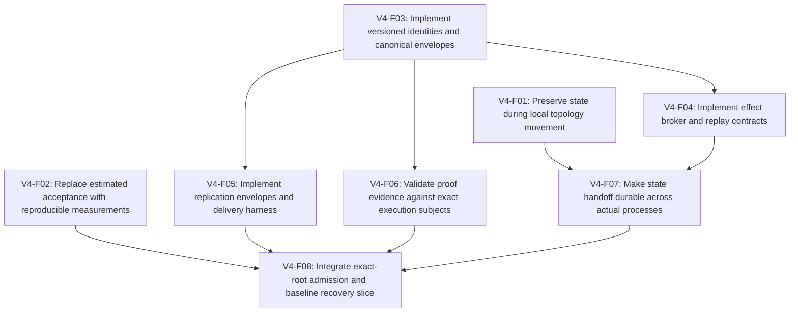

# Aether v4 implementation dependency tracker

Specification **0.1.0** · baseline `3c3c8ebe63078f104f1ab7d8182b088124e9b1c6`.

Generated from [plan.ts](../../../roadmap/v4/plan.ts). Read [SPEC.md](SPEC.md) for the normative contracts and [CHANGELOG.md](CHANGELOG.md) for version changes.

> This is implementation status. Publishing the specification does not complete runtime work. A verified task needs evidence for every gate; functional delivery does not imply that the release NFR/KPI gates passed.

**14/62 tasks verified; 71 source obligations tracked (40 functional, 16 NFR, 3 governance, 12 KPI).**

## First implementation slice

Recommended order (closed under prerequisites). Order among independent items reflects the requested priorities, not a technical dependency:

1. [V4-F01](#v4-f01) — Preserve state during local topology movement
2. [V4-F02](#v4-f02) — Replace estimated acceptance with reproducible measurements
3. [V4-F03](#v4-f03) — Implement versioned identities and canonical envelopes
4. [V4-F04](#v4-f04) — Implement effect broker and replay contracts
5. [V4-F05](#v4-f05) — Implement replication envelopes and delivery harness
6. [V4-F06](#v4-f06) — Validate proof evidence against exact execution subjects
7. [V4-F07](#v4-f07) — Make state handoff durable across actual processes
8. [V4-F08](#v4-f08) — Integrate exact-root admission and baseline recovery slice

The four research tasks can produce decisions early; the baseline release gate also requires their evidence. A dependency is a prerequisite for closing work, not a prohibition on early exploration. “Ready” means dependencies are verified, not that a task has started.

**Ready now:** [V4-T1-02](#v4-t1-02), [V4-T1-03](#v4-t1-03), [V4-T1-04](#v4-t1-04), [V4-T1-06](#v4-t1-06), [V4-T2-04](#v4-t2-04), [V4-T3-01](#v4-t3-01).

## Milestones

| Milestone | Verified | Total | Release gate |
|---|---:|---:|---|
| baseline | 13 | 13 | [V4-M0](#v4-m0) |
| v2 | 1 | 20 | [V4-M2](#v4-m2) |
| v3 | 0 | 14 | [V4-M3](#v4-m3) |
| v4 | 0 | 15 | [V4-M4](#v4-m4) |

## Task inventory

| Task | Deliverable | Owner | Milestone | Status | Prerequisites |
|---|---|---|---|---|---|
| [V4-F01](#v4-f01) | Preserve state during local topology movement | runtime | baseline | verified | — |
| [V4-F02](#v4-f02) | Replace estimated acceptance with reproducible measurements | measurement | baseline | verified | — |
| [V4-F03](#v4-f03) | Implement versioned identities and canonical envelopes | substrate | baseline | verified | — |
| [V4-F04](#v4-f04) | Implement effect broker and replay contracts | runtime | baseline | verified | [V4-F03](#v4-f03) |
| [V4-F05](#v4-f05) | Implement replication envelopes and delivery harness | distribution | baseline | verified | [V4-F03](#v4-f03) |
| [V4-F06](#v4-f06) | Validate proof evidence against exact execution subjects | verification | baseline | verified | [V4-F03](#v4-f03) |
| [V4-F07](#v4-f07) | Make state handoff durable across actual processes | distribution | baseline | verified | [V4-F01](#v4-f01), [V4-F04](#v4-f04) |
| [V4-F08](#v4-f08) | Integrate exact-root admission and baseline recovery slice | governance | baseline | verified | [V4-F02](#v4-f02), [V4-F05](#v4-f05), [V4-F06](#v4-f06), [V4-F07](#v4-f07) |
| [V4-R01](#v4-r01) | Select and model replication and quorum algorithms | distribution | baseline | verified | [V4-F03](#v4-f03) |
| [V4-R02](#v4-r02) | Measure native target feasibility | compiler | baseline | verified | — |
| [V4-R03](#v4-r03) | Select certificate calculus and private attestation statement | verification | baseline | verified | [V4-F03](#v4-f03) |
| [V4-R04](#v4-r04) | Define numerical and learning experiment contracts | synthesis | baseline | verified | — |
| [V4-T1-01](#v4-t1-01) | Content-addressed AST persistence | substrate | v2 | verified | [V4-F03](#v4-f03) |
| [V4-T1-02](#v4-t1-02) | Agent-IR and bidirectional projections | language | v2 | planned | [V4-F02](#v4-f02), [V4-T1-01](#v4-t1-01) |
| [V4-T1-03](#v4-t1-03) | Causal lineage and invariant fences | governance | v2 | planned | [V4-T1-01](#v4-t1-01), [V4-F06](#v4-f06) |
| [V4-T1-04](#v4-t1-04) | Structural and semantic index | retrieval | v2 | planned | [V4-T1-01](#v4-t1-01) |
| [V4-T1-05](#v4-t1-05) | Continuous semantic garbage collection | synthesis | v3 | planned | [V4-T1-03](#v4-t1-03), [V4-T2-10](#v4-t2-10), [V4-F08](#v4-f08) |
| [V4-T1-06](#v4-t1-06) | Tree-CRDT concurrency | distribution | v2 | planned | [V4-F05](#v4-f05), [V4-R01](#v4-r01), [V4-T1-01](#v4-t1-01) |
| [V4-T1-07](#v4-t1-07) | Module LoRA training and loading | synthesis | v3 | planned | [V4-R04](#v4-r04), [V4-T1-09](#v4-t1-09), [V4-T2-05](#v4-t2-05), [V4-F08](#v4-f08) |
| [V4-T1-08](#v4-t1-08) | Semantic binary lifting | compiler | v4 | planned | [V4-R02](#v4-r02), [V4-T2-04](#v4-t2-04), [V4-T3-10](#v4-t3-10) |
| [V4-T1-09](#v4-t1-09) | Typed cognitive scratchpads | substrate | v2 | planned | [V4-T1-01](#v4-t1-01), [V4-T1-03](#v4-t1-03) |
| [V4-T1-10](#v4-t1-10) | Federated private rewrite lemmas | verification | v4 | planned | [V4-T1-05](#v4-t1-05), [V4-T2-09](#v4-t2-09) |
| [V4-T1-11](#v4-t1-11) | Topological role induction | synthesis | v3 | planned | [V4-T1-04](#v4-t1-04), [V4-T1-07](#v4-t1-07), [V4-T1-09](#v4-t1-09), [V4-T2-05](#v4-t2-05) |
| [V4-T2-01](#v4-t2-01) | Executable cross-layer specifications | language | v2 | planned | [V4-T1-02](#v4-t1-02), [V4-T1-03](#v4-t1-03) |
| [V4-T2-02](#v4-t2-02) | Contract-first autonomous repair | runtime | v2 | planned | [V4-T2-01](#v4-t2-01), [V4-F04](#v4-f04), [V4-F06](#v4-f06), [V4-F08](#v4-f08), [V4-T3-07](#v4-t3-07) |
| [V4-T2-03](#v4-t2-03) | Invariant CEGIS | verification | v2 | planned | [V4-F06](#v4-f06), [V4-T2-01](#v4-t2-01) |
| [V4-T2-04](#v4-t2-04) | Object-capability containment | security | v2 | planned | [V4-F04](#v4-f04), [V4-F07](#v4-f07) |
| [V4-T2-05](#v4-t2-05) | Economic resource types | runtime | v2 | planned | [V4-F04](#v4-f04), [V4-T2-04](#v4-t2-04) |
| [V4-T2-06](#v4-t2-06) | Heterogeneous Byzantine promotion quorum | governance | v2 | planned | [V4-R01](#v4-r01), [V4-F08](#v4-f08), [V4-T1-06](#v4-t1-06), [V4-T2-10](#v4-t2-10) |
| [V4-T2-07](#v4-t2-07) | State lens synthesis | persistence | v2 | planned | [V4-F07](#v4-f07), [V4-T2-01](#v4-t2-01), [V4-T2-10](#v4-t2-10) |
| [V4-T2-08](#v4-t2-08) | Minimal distinguishing examples | synthesis | v2 | planned | [V4-T2-01](#v4-t2-01), [V4-T1-09](#v4-t1-09) |
| [V4-T2-09](#v4-t2-09) | Zero-knowledge module attestation | verification | v4 | planned | [V4-R03](#v4-r03), [V4-T2-10](#v4-t2-10), [V4-T1-08](#v4-t1-08) |
| [V4-T2-10](#v4-t2-10) | Portable AST proof certificates | verification | v2 | in_progress | [V4-R03](#v4-r03), [V4-F06](#v4-f06) |
| [V4-T2-11](#v4-t2-11) | Metamorphic relation synthesis | verification | v3 | planned | [V4-T2-03](#v4-t2-03), [V4-T3-03](#v4-t3-03) |
| [V4-T2-12](#v4-t2-12) | Multimodal intent anchors | language | v3 | planned | [V4-T2-08](#v4-t2-08), [V4-T3-08](#v4-t3-08) |
| [V4-T3-01](#v4-t3-01) | Reversible execution and resumable checkpoints | runtime | v2 | planned | [V4-F07](#v4-f07) |
| [V4-T3-02](#v4-t3-02) | MCTS over copy-on-write heaps | synthesis | v3 | planned | [V4-T3-01](#v4-t3-01), [V4-T2-05](#v4-t2-05), [V4-T3-03](#v4-t3-03), [V4-F08](#v4-f08) |
| [V4-T3-03](#v4-t3-03) | Living micro-world campaigns | verification | v2 | planned | [V4-F04](#v4-f04), [V4-T3-01](#v4-t3-01), [V4-R04](#v4-r04) |
| [V4-T3-04](#v4-t3-04) | Historical counterfactual replay | runtime | v2 | planned | [V4-T3-01](#v4-t3-01), [V4-T3-03](#v4-t3-03) |
| [V4-T3-05](#v4-t3-05) | Polyhedral accelerator kernels | compiler | v4 | planned | [V4-R02](#v4-r02), [V4-R04](#v4-r04), [V4-T3-10](#v4-t3-10), [V4-T2-10](#v4-t2-10) |
| [V4-T3-06](#v4-t3-06) | Differentiable program relaxation | synthesis | v4 | planned | [V4-R04](#v4-r04), [V4-T3-02](#v4-t3-02), [V4-T3-05](#v4-t3-05) |
| [V4-T3-07](#v4-t3-07) | Three-level runtime fallback trees | runtime | v2 | planned | [V4-F04](#v4-f04), [V4-F06](#v4-f06), [V4-T3-01](#v4-t3-01) |
| [V4-T3-08](#v4-t3-08) | Spatial-semantic UI runtime | language | v3 | planned | [V4-T1-02](#v4-t1-02), [V4-T2-01](#v4-t2-01) |
| [V4-T3-09](#v4-t3-09) | Persona and accessibility evaluation | verification | v3 | planned | [V4-T3-08](#v4-t3-08), [V4-T3-03](#v4-t3-03) |
| [V4-T3-10](#v4-t3-10) | Packed heap and native value ABI | compiler | v4 | planned | [V4-R02](#v4-r02), [V4-R04](#v4-r04), [V4-T3-01](#v4-t3-01) |
| [V4-T3-11](#v4-t3-11) | Gradient-directed fuzzing | verification | v3 | planned | [V4-R04](#v4-r04), [V4-T3-03](#v4-t3-03) |
| [V4-T3-12](#v4-t3-12) | Bayesian failure risk surfaces | measurement | v3 | planned | [V4-T1-03](#v4-t1-03), [V4-T3-03](#v4-t3-03), [V4-F08](#v4-f08) |
| [V4-T4-01](#v4-t4-01) | Fluid production topology | distribution | v3 | planned | [V4-T2-04](#v4-t2-04), [V4-T2-07](#v4-t2-07), [V4-T2-06](#v4-t2-06), [V4-F07](#v4-f07) |
| [V4-T4-02](#v4-t4-02) | Negotiated ephemeral wire codecs | distribution | v4 | planned | [V4-T4-01](#v4-t4-01), [V4-T3-10](#v4-t3-10) |
| [V4-T4-03](#v4-t4-03) | Production optimization surfaces | measurement | v3 | planned | [V4-T4-01](#v4-t4-01), [V4-T2-05](#v4-t2-05), [V4-F08](#v4-f08) |
| [V4-T4-04](#v4-t4-04) | Evolutionary shadow deployment | distribution | v3 | planned | [V4-T4-01](#v4-t4-01), [V4-T3-04](#v4-t3-04), [V4-T3-07](#v4-t3-07), [V4-T4-03](#v4-t4-03) |
| [V4-T4-05](#v4-t4-05) | Bootable ephemeral unikernels | compiler | v4 | planned | [V4-R02](#v4-r02), [V4-T3-10](#v4-t3-10), [V4-T2-04](#v4-t2-04) |
| [V4-Q01](#v4-q01) | Production-scale storage and replication evidence | measurement | v4 | planned | [V4-F02](#v4-f02), [V4-T1-01](#v4-t1-01), [V4-T1-06](#v4-t1-06), [V4-T2-06](#v4-t2-06) |
| [V4-Q02](#v4-q02) | Runtime, proof and hardware performance gates | measurement | v4 | planned | [V4-F02](#v4-f02), [V4-T1-02](#v4-t1-02), [V4-T2-07](#v4-t2-07), [V4-T2-09](#v4-t2-09), [V4-T2-10](#v4-t2-10), [V4-T3-01](#v4-t3-01), [V4-T3-07](#v4-t3-07), [V4-T4-05](#v4-t4-05) |
| [V4-Q03](#v4-q03) | Representative real-token efficiency gates | measurement | v4 | planned | [V4-F02](#v4-f02), [V4-T1-02](#v4-t1-02), [V4-T1-07](#v4-t1-07) |
| [V4-Q04](#v4-q04) | Multimodal quality and latency gates | measurement | v4 | planned | [V4-F02](#v4-f02), [V4-T2-12](#v4-t2-12), [V4-T3-09](#v4-t3-09) |
| [V4-Q05](#v4-q05) | Determinism, containment and governance assurance | security | v4 | planned | [V4-T1-03](#v4-t1-03), [V4-T1-08](#v4-t1-08), [V4-T2-04](#v4-t2-04), [V4-T2-06](#v4-t2-06), [V4-T2-09](#v4-t2-09), [V4-T3-04](#v4-t3-04), [V4-T3-05](#v4-t3-05), [V4-T3-10](#v4-t3-10), [V4-T4-05](#v4-t4-05) |
| [V4-Q06](#v4-q06) | End-to-end KPI validation | measurement | v4 | planned | [V4-Q01](#v4-q01), [V4-Q02](#v4-q02), [V4-Q03](#v4-q03), [V4-Q04](#v4-q04), [V4-Q05](#v4-q05), [V4-T1-10](#v4-t1-10), [V4-T1-11](#v4-t1-11), [V4-T3-06](#v4-t3-06), [V4-T3-12](#v4-t3-12), [V4-T4-04](#v4-t4-04) |
| [V4-M0](#v4-m0) | baseline completion gate | release | baseline | verified | [V4-F01](#v4-f01), [V4-F02](#v4-f02), [V4-F03](#v4-f03), [V4-F04](#v4-f04), [V4-F05](#v4-f05), [V4-F06](#v4-f06), [V4-F07](#v4-f07), [V4-F08](#v4-f08), [V4-R01](#v4-r01), [V4-R02](#v4-r02), [V4-R03](#v4-r03), [V4-R04](#v4-r04) |
| [V4-M2](#v4-m2) | v2 completion gate | release | v2 | planned | [V4-T1-01](#v4-t1-01), [V4-T1-02](#v4-t1-02), [V4-T1-03](#v4-t1-03), [V4-T1-04](#v4-t1-04), [V4-T1-06](#v4-t1-06), [V4-T1-09](#v4-t1-09), [V4-T2-01](#v4-t2-01), [V4-T2-02](#v4-t2-02), [V4-T2-03](#v4-t2-03), [V4-T2-04](#v4-t2-04), [V4-T2-05](#v4-t2-05), [V4-T2-06](#v4-t2-06), [V4-T2-07](#v4-t2-07), [V4-T2-08](#v4-t2-08), [V4-T2-10](#v4-t2-10), [V4-T3-01](#v4-t3-01), [V4-T3-03](#v4-t3-03), [V4-T3-04](#v4-t3-04), [V4-T3-07](#v4-t3-07), [V4-M0](#v4-m0) |
| [V4-M3](#v4-m3) | v3 completion gate | release | v3 | planned | [V4-T1-05](#v4-t1-05), [V4-T1-07](#v4-t1-07), [V4-T1-11](#v4-t1-11), [V4-T2-11](#v4-t2-11), [V4-T2-12](#v4-t2-12), [V4-T3-02](#v4-t3-02), [V4-T3-08](#v4-t3-08), [V4-T3-09](#v4-t3-09), [V4-T3-11](#v4-t3-11), [V4-T3-12](#v4-t3-12), [V4-T4-01](#v4-t4-01), [V4-T4-03](#v4-t4-03), [V4-T4-04](#v4-t4-04), [V4-M2](#v4-m2) |
| [V4-M4](#v4-m4) | v4 completion gate | release | v4 | planned | [V4-T1-08](#v4-t1-08), [V4-T1-10](#v4-t1-10), [V4-T2-09](#v4-t2-09), [V4-T3-05](#v4-t3-05), [V4-T3-06](#v4-t3-06), [V4-T3-10](#v4-t3-10), [V4-T4-02](#v4-t4-02), [V4-T4-05](#v4-t4-05), [V4-Q01](#v4-q01), [V4-Q02](#v4-q02), [V4-Q03](#v4-q03), [V4-Q04](#v4-q04), [V4-Q05](#v4-q05), [V4-Q06](#v4-q06), [V4-M3](#v4-m3) |

## Dependency waves

Levels are derived from prerequisites. They are not time estimates.

- **Wave 0:** [V4-F01](#v4-f01), [V4-F02](#v4-f02), [V4-F03](#v4-f03), [V4-R02](#v4-r02), [V4-R04](#v4-r04)
- **Wave 1:** [V4-F04](#v4-f04), [V4-F05](#v4-f05), [V4-F06](#v4-f06), [V4-R01](#v4-r01), [V4-R03](#v4-r03), [V4-T1-01](#v4-t1-01)
- **Wave 2:** [V4-F07](#v4-f07), [V4-T1-02](#v4-t1-02), [V4-T1-03](#v4-t1-03), [V4-T1-04](#v4-t1-04), [V4-T1-06](#v4-t1-06), [V4-T2-10](#v4-t2-10)
- **Wave 3:** [V4-F08](#v4-f08), [V4-T1-09](#v4-t1-09), [V4-T2-01](#v4-t2-01), [V4-T2-04](#v4-t2-04), [V4-T3-01](#v4-t3-01)
- **Wave 4:** [V4-T1-05](#v4-t1-05), [V4-T2-03](#v4-t2-03), [V4-T2-05](#v4-t2-05), [V4-T2-06](#v4-t2-06), [V4-T2-07](#v4-t2-07), [V4-T2-08](#v4-t2-08), [V4-T3-03](#v4-t3-03), [V4-T3-07](#v4-t3-07), [V4-T3-08](#v4-t3-08), [V4-T3-10](#v4-t3-10), [V4-M0](#v4-m0)
- **Wave 5:** [V4-T1-07](#v4-t1-07), [V4-T1-08](#v4-t1-08), [V4-T2-02](#v4-t2-02), [V4-T2-11](#v4-t2-11), [V4-T2-12](#v4-t2-12), [V4-T3-02](#v4-t3-02), [V4-T3-04](#v4-t3-04), [V4-T3-05](#v4-t3-05), [V4-T3-09](#v4-t3-09), [V4-T3-11](#v4-t3-11), [V4-T3-12](#v4-t3-12), [V4-T4-01](#v4-t4-01), [V4-T4-05](#v4-t4-05), [V4-Q01](#v4-q01)
- **Wave 6:** [V4-T1-11](#v4-t1-11), [V4-T2-09](#v4-t2-09), [V4-T3-06](#v4-t3-06), [V4-T4-02](#v4-t4-02), [V4-T4-03](#v4-t4-03), [V4-Q03](#v4-q03), [V4-Q04](#v4-q04), [V4-M2](#v4-m2)
- **Wave 7:** [V4-T1-10](#v4-t1-10), [V4-T4-04](#v4-t4-04), [V4-Q02](#v4-q02), [V4-Q05](#v4-q05)
- **Wave 8:** [V4-Q06](#v4-q06), [V4-M3](#v4-m3)
- **Wave 9:** [V4-M4](#v4-m4)

## First-slice dependency graph

## Requirement traceability

| Requirement | Source | Target | Work covering it |
|---|---|---|---|
| V4-FR-1.1: Content-addressed AST persistence | PRD §5 FR-1.1 | Full functional scope in the preserved v4 PRD, qualified only by explicit versioned decisions. | [V4-F03](#v4-f03), [V4-T1-01](#v4-t1-01) |
| V4-FR-1.2: Agent-IR and bidirectional projections | PRD §5 FR-1.2 | Full functional scope in the preserved v4 PRD, qualified only by explicit versioned decisions. | [V4-T1-02](#v4-t1-02) |
| V4-FR-1.3: Causal lineage and invariant fences | PRD §5 FR-1.3 | Full functional scope in the preserved v4 PRD, qualified only by explicit versioned decisions. | [V4-F03](#v4-f03), [V4-F08](#v4-f08), [V4-T1-03](#v4-t1-03) |
| V4-FR-1.4: Structural and semantic index | PRD §5 FR-1.4 | Full functional scope in the preserved v4 PRD, qualified only by explicit versioned decisions. | [V4-T1-04](#v4-t1-04) |
| V4-FR-1.5: Continuous semantic garbage collection | PRD §5 FR-1.5 | Full functional scope in the preserved v4 PRD, qualified only by explicit versioned decisions. | [V4-T1-05](#v4-t1-05) |
| V4-FR-1.6: Tree-CRDT concurrency | PRD §5 FR-1.6 | Full functional scope in the preserved v4 PRD, qualified only by explicit versioned decisions. | [V4-F05](#v4-f05), [V4-T1-06](#v4-t1-06) |
| V4-FR-1.7: Module LoRA training and loading | PRD §5 FR-1.7 | Full functional scope in the preserved v4 PRD, qualified only by explicit versioned decisions. | [V4-T1-07](#v4-t1-07) |
| V4-FR-1.8: Semantic binary lifting | PRD §5 FR-1.8 | Full functional scope in the preserved v4 PRD, qualified only by explicit versioned decisions. | [V4-T1-08](#v4-t1-08) |
| V4-FR-1.9: Typed cognitive scratchpads | PRD §5 FR-1.9 | Full functional scope in the preserved v4 PRD, qualified only by explicit versioned decisions. | [V4-T1-09](#v4-t1-09) |
| V4-FR-1.10: Federated private rewrite lemmas | PRD §5 FR-1.10 | Full functional scope in the preserved v4 PRD, qualified only by explicit versioned decisions. | [V4-T1-10](#v4-t1-10) |
| V4-FR-1.11: Topological role induction | PRD §5 FR-1.11 | Full functional scope in the preserved v4 PRD, qualified only by explicit versioned decisions. | [V4-T1-11](#v4-t1-11) |
| V4-FR-2.1: Executable cross-layer specifications | PRD §5 FR-2.1 | Full functional scope in the preserved v4 PRD, qualified only by explicit versioned decisions. | [V4-T2-01](#v4-t2-01) |
| V4-FR-2.2: Contract-first autonomous repair | PRD §5 FR-2.2 | Full functional scope in the preserved v4 PRD, qualified only by explicit versioned decisions. | [V4-F06](#v4-f06), [V4-T2-02](#v4-t2-02) |
| V4-FR-2.3: Invariant CEGIS | PRD §5 FR-2.3 | Full functional scope in the preserved v4 PRD, qualified only by explicit versioned decisions. | [V4-T2-03](#v4-t2-03) |
| V4-FR-2.4: Object-capability containment | PRD §5 FR-2.4 | Full functional scope in the preserved v4 PRD, qualified only by explicit versioned decisions. | [V4-F07](#v4-f07), [V4-T2-04](#v4-t2-04) |
| V4-FR-2.5: Economic resource types | PRD §5 FR-2.5 | Full functional scope in the preserved v4 PRD, qualified only by explicit versioned decisions. | [V4-T2-05](#v4-t2-05) |
| V4-FR-2.6: Heterogeneous Byzantine promotion quorum | PRD §5 FR-2.6 | Full functional scope in the preserved v4 PRD, qualified only by explicit versioned decisions. | [V4-F08](#v4-f08), [V4-T2-06](#v4-t2-06) |
| V4-FR-2.7: State lens synthesis | PRD §5 FR-2.7 | Full functional scope in the preserved v4 PRD, qualified only by explicit versioned decisions. | [V4-T2-07](#v4-t2-07) |
| V4-FR-2.8: Minimal distinguishing examples | PRD §5 FR-2.8 | Full functional scope in the preserved v4 PRD, qualified only by explicit versioned decisions. | [V4-T2-08](#v4-t2-08) |
| V4-FR-2.9: Zero-knowledge module attestation | PRD §5 FR-2.9 | Full functional scope in the preserved v4 PRD, qualified only by explicit versioned decisions. | [V4-T2-09](#v4-t2-09) |
| V4-FR-2.10: Portable AST proof certificates | PRD §5 FR-2.10 | Full functional scope in the preserved v4 PRD, qualified only by explicit versioned decisions. | [V4-F06](#v4-f06), [V4-T2-10](#v4-t2-10) |
| V4-FR-2.11: Metamorphic relation synthesis | PRD §5 FR-2.11 | Full functional scope in the preserved v4 PRD, qualified only by explicit versioned decisions. | [V4-T2-11](#v4-t2-11) |
| V4-FR-2.12: Multimodal intent anchors | PRD §5 FR-2.12 | Full functional scope in the preserved v4 PRD, qualified only by explicit versioned decisions. | [V4-T2-12](#v4-t2-12) |
| V4-FR-3.1: Reversible execution and resumable checkpoints | PRD §5 FR-3.1 | Full functional scope in the preserved v4 PRD, qualified only by explicit versioned decisions. | [V4-F01](#v4-f01), [V4-T3-01](#v4-t3-01) |
| V4-FR-3.2: MCTS over copy-on-write heaps | PRD §5 FR-3.2 | Full functional scope in the preserved v4 PRD, qualified only by explicit versioned decisions. | [V4-T3-02](#v4-t3-02) |
| V4-FR-3.3: Living micro-world campaigns | PRD §5 FR-3.3 | Full functional scope in the preserved v4 PRD, qualified only by explicit versioned decisions. | [V4-T3-03](#v4-t3-03) |
| V4-FR-3.4: Historical counterfactual replay | PRD §5 FR-3.4 | Full functional scope in the preserved v4 PRD, qualified only by explicit versioned decisions. | [V4-F04](#v4-f04), [V4-F07](#v4-f07), [V4-T3-04](#v4-t3-04) |
| V4-FR-3.5: Polyhedral accelerator kernels | PRD §5 FR-3.5 | Full functional scope in the preserved v4 PRD, qualified only by explicit versioned decisions. | [V4-T3-05](#v4-t3-05) |
| V4-FR-3.6: Differentiable program relaxation | PRD §5 FR-3.6 | Full functional scope in the preserved v4 PRD, qualified only by explicit versioned decisions. | [V4-T3-06](#v4-t3-06) |
| V4-FR-3.7: Three-level runtime fallback trees | PRD §5 FR-3.7 | Full functional scope in the preserved v4 PRD, qualified only by explicit versioned decisions. | [V4-F04](#v4-f04), [V4-T3-07](#v4-t3-07) |
| V4-FR-3.8: Spatial-semantic UI runtime | PRD §5 FR-3.8 | Full functional scope in the preserved v4 PRD, qualified only by explicit versioned decisions. | [V4-T3-08](#v4-t3-08) |
| V4-FR-3.9: Persona and accessibility evaluation | PRD §5 FR-3.9 | Full functional scope in the preserved v4 PRD, qualified only by explicit versioned decisions. | [V4-T3-09](#v4-t3-09) |
| V4-FR-3.10: Packed heap and native value ABI | PRD §5 FR-3.10 | Full functional scope in the preserved v4 PRD, qualified only by explicit versioned decisions. | [V4-T3-10](#v4-t3-10) |
| V4-FR-3.11: Gradient-directed fuzzing | PRD §5 FR-3.11 | Full functional scope in the preserved v4 PRD, qualified only by explicit versioned decisions. | [V4-T3-11](#v4-t3-11) |
| V4-FR-3.12: Bayesian failure risk surfaces | PRD §5 FR-3.12 | Full functional scope in the preserved v4 PRD, qualified only by explicit versioned decisions. | [V4-T3-12](#v4-t3-12) |
| V4-FR-4.1: Fluid production topology | PRD §5 FR-4.1 | Full functional scope in the preserved v4 PRD, qualified only by explicit versioned decisions. | [V4-F01](#v4-f01), [V4-F07](#v4-f07), [V4-T4-01](#v4-t4-01) |
| V4-FR-4.2: Negotiated ephemeral wire codecs | PRD §5 FR-4.2 | Full functional scope in the preserved v4 PRD, qualified only by explicit versioned decisions. | [V4-T4-02](#v4-t4-02) |
| V4-FR-4.3: Production optimization surfaces | PRD §5 FR-4.3 | Full functional scope in the preserved v4 PRD, qualified only by explicit versioned decisions. | [V4-T4-03](#v4-t4-03) |
| V4-FR-4.4: Evolutionary shadow deployment | PRD §5 FR-4.4 | Full functional scope in the preserved v4 PRD, qualified only by explicit versioned decisions. | [V4-F04](#v4-f04), [V4-F08](#v4-f08), [V4-T4-04](#v4-t4-04) |
| V4-FR-4.5: Bootable ephemeral unikernels | PRD §5 FR-4.5 | Full functional scope in the preserved v4 PRD, qualified only by explicit versioned decisions. | [V4-T4-05](#v4-t4-05) |
| V4-NFR-01: AST retrieval | PRD §7 table | ≤2 ms at 100M DAG nodes | [V4-Q01](#v4-q01) |
| V4-NFR-02: Tree-CRDT convergence | PRD §7 table | ≤50 ms across 1,000 agents | [V4-Q01](#v4-q01) |
| V4-NFR-03: Checkpoint rollback | PRD §7 table | ≤5 ms | [V4-Q02](#v4-q02) |
| V4-NFR-04: Fallback switch | PRD §7 table | ≤50 ns within the active frame | [V4-Q02](#v4-q02) |
| V4-NFR-05: Certificate checking | PRD §7 table | ≤50 µs per bounded certificate | [V4-Q02](#v4-q02) |
| V4-NFR-06: Unikernel cold boot | PRD §7 table | ≤1 ms; ≤2 MB footprint per FR-4.5 | [V4-Q02](#v4-q02) |
| V4-NFR-07: State lens overhead | PRD §7 table | ≤3.5% versus raw SQL | [V4-Q02](#v4-q02) |
| V4-NFR-08: SMT hard cutoff | PRD §7 table | ≤1,500 ms | [V4-Q02](#v4-q02) |
| V4-NFR-09: Projection throughput | PRD §7 table | ≥75,000 lines/sec | [V4-Q02](#v4-q02) |
| V4-NFR-10: ZK module verification | PRD §7 table | ≤5 ms | [V4-Q02](#v4-q02) |
| V4-NFR-11: Agent-IR density | PRD §7 table | ≥4× actual token compression | [V4-F02](#v4-f02), [V4-Q03](#v4-q03) |
| V4-NFR-12: Multimodal extraction | PRD §7 table | ≤400 ms Figma-to-AST | [V4-Q04](#v4-q04) |
| V4-NFR-13: Concurrent mutation safety | PRD §7.1 | 1,000 mutating agents; no lock contention, deadlocks or write skew | [V4-Q01](#v4-q01) |
| V4-NFR-14: Graph capacity | PRD §7.1 | 100M nodes; hash-index retrieval with declared scaling behavior | [V4-Q01](#v4-q01) |
| V4-NFR-15: Bit-level determinism | PRD §7.2 | Identical heaps/register states for identical event logs, inputs and tokens | [V4-Q05](#v4-q05) |
| V4-NFR-16: Capability containment | PRD §7.2 | Pr[Escape] = 0 under the explicitly proved model and trusted computing base | [V4-Q05](#v4-q05) |
| V4-GOV-01: Causal production audit | PRD §9.1 | Every production byte links to signed provenance, spec, evaluators and validation logs | [V4-Q05](#v4-q05) |
| V4-GOV-02: Hardware-backed revocation | PRD §9.2 | Governor hardware token revokes authority globally without rebuild/restart | [V4-Q05](#v4-q05) |
| V4-GOV-03: Governance export | PRD §9.3 | Signed compliance ledger; named control mappings and independent assessment scope | [V4-Q05](#v4-q05) |
| V4-KPI-01: Feature completion time | PRD §11 table | ≤10 minutes autonomous MTTC | [V4-Q06](#v4-q06) |
| V4-KPI-02: Tokens per change | PRD §11 table | ≤18% of defined baseline | [V4-Q06](#v4-q06) |
| V4-KPI-03: Unhandled production regressions | PRD §11 table | ≤0.0001% of deployments | [V4-Q06](#v4-q06) |
| V4-KPI-04: Autonomous tuning dominance | PRD §11 table | ≥85% autonomously optimized | [V4-Q06](#v4-q06) |
| V4-KPI-05: Sandbox escape incidents | PRD §11 table | 0 incidents under the declared threat model | [V4-Q06](#v4-q06) |
| V4-KPI-06: Concurrency conflict stalls | PRD §11 table | 0% attributable to merge conflict stalls | [V4-Q06](#v4-q06) |
| V4-KPI-07: Proof latency KPI | PRD §11 table | ≤50 µs | [V4-Q06](#v4-q06) |
| V4-KPI-08: Cold-start KPI | PRD §11 table | ≤1 ms | [V4-Q06](#v4-q06) |
| V4-KPI-09: Development velocity reduction | PRD §11 item 1 | ≥92% elapsed time reduction | [V4-Q06](#v4-q06) |
| V4-KPI-10: Total context reduction | PRD §11 item 2 | ≥80% total input/output tokens saved | [V4-Q06](#v4-q06) |
| V4-KPI-11: Supply-chain containment | PRD §11 item 3 | 100% unauthorized syscall/memory/exfiltration containment in stated model | [V4-Q06](#v4-q06) |
| V4-KPI-12: Autonomous Pareto improvement | PRD §11 item 4 | ≥85% optimizations discovered and deployed without human engineering intervention | [V4-Q06](#v4-q06) |

## Task contracts

### V4-F01

**Preserve state during local topology movement** · implementation · baseline · owner: runtime · **verified**

Prerequisites: none.

- ProductionRuntime export/import snapshot and atomic TopologyHost handoff; retain public reference identity.
- Cover every rebuilt unit, nested aliases, allocations and migration rollback; preserve policy and telemetry.

Acceptance gates:

- **V4-F01/G1** — The reviewed ledger reproduction retains balances 90/10 after movement and accepts the next transfer.
- **V4-F01/G2** — Nested/shared/cyclic records and unrelated functions retain state; fresh allocations cannot collide.
- **V4-F01/G3** — Same-unit movement is a no-op; invalid target, active call, snapshot failure or compile failure leaves the old plan and heaps usable.

Evidence: [manifest](../../../docs/implementation/v4/evidence/foundations-4a9b077/V4-F01.json).

### V4-F02

**Replace estimated acceptance with reproducible measurements** · implementation · baseline · owner: measurement · **verified**

Prerequisites: none.

- Real tokenizer measurements for warm bodies, complete warm messages, cold modules and complete change sessions.
- Machine-readable benchmark manifests; distinguish correctness, measurement and target enforcement commands.
- Correct README/test-count/dependency and density claims using measured scope.

Acceptance gates:

- **V4-F02/G1** — The default ledger reproduces 698 TypeScript / 343 IR body / 375 warm message tokens with cl100k_base, or records an explained versioned fixture change.
- **V4-F02/G2** — A truthful measured miss is recorded as fail, never rewritten to pass; --enforce returns nonzero for failed or unmeasured required targets.
- **V4-F02/G3** — Ratios use summed actual tokens and include dictionary/framing costs; reports bind commit, tokenizer, corpus, environment and raw samples.

Evidence: [manifest](../../../docs/implementation/v4/evidence/foundations-4a9b077/V4-F02.json).

### V4-F03

**Implement versioned identities and canonical envelopes** · implementation · baseline · owner: substrate · **verified**

Prerequisites: none.

- Versioned execution manifest, state identity and metadata sidecars; explicit v1 object compatibility.
- Canonical tagged value encoding and hashed envelopes shared by effects, replication and evidence.

Acceptance gates:

- **V4-F03/G1** — Existing v1 object addresses remain readable and unchanged; schema changes allocate a new encoding version.
- **V4-F03/G2** — Different semantic/dependency/policy versions cannot reuse an execution-manifest digest; metadata-only observations do not change AST identity.
- **V4-F03/G3** — Malformed tags, duplicate map keys, unsafe integer conversions, unsupported versions and oversized payloads fail before mutation.

Evidence: [manifest](../../../docs/implementation/v4/evidence/foundations-4a9b077/V4-F03.json).

### V4-F04

**Implement effect broker and replay contracts** · implementation · baseline · owner: runtime · **verified**

Prerequisites: [V4-F03](#v4-f03).

- Single broker for invoke, nondeterministic reads, effect identity, durable outcomes and replay/shadow/speculative modes.
- Reservation interface for budgets and explicit adapter support for prepare/commit, idempotency and reconciliation.

Acceptance gates:

- **V4-F04/G1** — Replay and shadow invoke no live mutating adapter; replay mismatch fails deterministically.
- **V4-F04/G2** — Identical retries return the recorded outcome; reused effect ID with a different payload is rejected.
- **V4-F04/G3** — Crash after external commit but before receipt persistence becomes indeterminate and is reconciled; no blind retry or false abort.

Evidence: [manifest](../../../docs/implementation/v4/evidence/contracts-3dce2d6/V4-F04.json).

### V4-F05

**Implement replication envelopes and delivery harness** · implementation · baseline · owner: distribution · **verified**

Prerequisites: [V4-F03](#v4-f03).

- Authenticated replica/occurrence/operation identities, causal frontier and durable operation ingestion.
- Deterministic test transport with duplication, reordering, drops, partitions and restart.

Acceptance gates:

- **V4-F05/G1** — Duplicate operations are idempotent and reuse of an operation ID with different bytes is rejected.
- **V4-F05/G2** — Unknown causal predecessors remain pending, invalid signatures cannot mutate the workspace, and restart restores accepted operations.
- **V4-F05/G3** — Candidate synchronization cannot update production roots; harness reports missing replicas and delivery assumptions.

Evidence: [manifest](../../../docs/implementation/v4/evidence/contracts-3dce2d6/V4-F05.json).

### V4-F06

**Validate proof evidence against exact execution subjects** · implementation · baseline · owner: verification · **verified**

Prerequisites: [V4-F03](#v4-f03).

- Evidence envelope and admission policy around existing VerificationReport; distinguish local solver evidence from portable certificates.
- Closed-world obligation enumeration, dependency closure, assumptions, resource limits and invalidation checks.

Acceptance gates:

- **V4-F06/G1** — Changed AST, contract, callee, semantics, compiler, capability policy or target invalidates dependent evidence.
- **V4-F06/G2** — Missing/truncated/duplicate obligations, undeclared assumptions, timeout, forged reports and unchecked caller preconditions cannot authorize proof elision.
- **V4-F06/G3** — Property evidence never satisfies a formal-required gate; local reports received from an untrusted peer are reverified.

Evidence: [manifest](../../../docs/implementation/v4/evidence/contracts-3dce2d6/V4-F06.json).

### V4-F07

**Make state handoff durable across actual processes** · implementation · baseline · owner: distribution · **verified**

Prerequisites: [V4-F01](#v4-f01), [V4-F04](#v4-f04).

- Authenticated framed process transport and scoped remote references; durable migration intent, snapshots, ownership epochs and recovery.
- Unify direct/cross-unit call admission and explicit timeout, cancellation and committed/indeterminate outcomes.

Acceptance gates:

- **V4-F07/G1** — Two real child processes preserve ledger state and aliasing after migration, restart and failures at every handoff boundary.
- **V4-F07/G2** — At most one ownership epoch may write; stale owner calls and unauthorized transport calls fail.
- **V4-F07/G3** — No heap address is mistaken for a record in another heap; in-flight effects cannot be duplicated by migration or timeout retries.

Evidence: [manifest](../../../docs/implementation/v4/evidence/process-4129dfc/V4-F07.json).

### V4-F08

**Integrate exact-root admission and baseline recovery slice** · implementation · baseline · owner: governance · **verified**

Prerequisites: [V4-F02](#v4-f02), [V4-F05](#v4-f05), [V4-F06](#v4-f06), [V4-F07](#v4-f07).

- Durable candidate → validated → authorized → prepared → active promotion state machine with compare-and-swap on the parent root.
- Local authenticated governor authorization adapter; heterogeneous quorum remains a separate requirement.

Acceptance gates:

- **V4-F08/G1** — Combined edits are reverified at the resulting root; stale authorization, old parent root and changed policy cannot promote.
- **V4-F08/G2** — Crash/restart at every state converges to the durable decision, with one active root and an auditable recovery record.
- **V4-F08/G3** — End-to-end ledger flow uses two processes, a recorded effect, migration, candidate rejection, promotion and rollback without duplicate appends.

Evidence: [manifest](../../../docs/implementation/v4/evidence/process-4129dfc/V4-F08.json).

### V4-R01

**Select and model replication and quorum algorithms** · research · baseline · owner: distribution · **verified**

Prerequisites: [V4-F03](#v4-f03).

- ADR with occurrence-tree algorithm, state/operation representation, Byzantine protocol and key lifecycle.

Acceptance gates:

- **V4-R01/G1** — Model cycles, concurrent moves, quorum intersection, equivocation, membership changes and partition recovery; record assumptions and rejected alternatives.

Evidence: [manifest](../../../docs/implementation/v4/evidence/research-749ce8b/V4-R01.json).

### V4-R02

**Measure native target feasibility** · research · baseline · owner: compiler · **verified**

Prerequisites: none.

- ADR and bounded prototypes for ABI, typed native lowering, hypervisor/driver target, fallback and boot measurements.

Acceptance gates:

- **V4-R02/G1** — Measure real code and boot artifacts with named hardware; report misses for 50 ns / 1 ms / 2 MB without weakening the targets.

Evidence: [manifest](../../../docs/implementation/v4/evidence/research-749ce8b/V4-R02.json).

### V4-R03

**Select certificate calculus and private attestation statement** · research · baseline · owner: verification · **verified**

Prerequisites: [V4-F03](#v4-f03).

- ADR for proof kernel, solver proof extraction, ZK statement/witness, target binding and key/setup assumptions.

Acceptance gates:

- **V4-R03/G1** — Prototype a nontrivial certificate and private artifact assertion, reject false claims, measure proof generation/checking and document fragment limits.

Evidence: [manifest](../../../docs/implementation/v4/evidence/research-749ce8b/V4-R03.json).

### V4-R04

**Define numerical and learning experiment contracts** · research · baseline · owner: synthesis · **verified**

Prerequisites: none.

- ADR for numeric semantics, differentiable subset, model/adapter API and held-out workload/budget protocol.

Acceptance gates:

- **V4-R04/G1** — Demonstrate a gradient path and adapter load/train path on bounded fixtures; document numerical behavior, cost and provider capability constraints.
- **V4-R04/G2** — Fix numerical acceptance profiles for the source millions-of-permutations-per-second and tens-of-iterations targets before experiments; state exact thresholds and supported workloads.

Evidence: [manifest](../../../docs/implementation/v4/evidence/research-749ce8b/V4-R04.json).

### V4-T1-01

**Content-addressed AST persistence** · implementation · v2 · owner: substrate · **verified**

Prerequisites: [V4-F03](#v4-f03).

- Versioned durable DAG, reachability/index maintenance, import/export and compatibility migration.

Acceptance gates:

- **V4-T1-01/G1** — Check hashes, grouped child semantics, deduplication and corruption detection across reopen/import.
- **V4-T1-01/G2** — Verify concurrent durable root updates and GC preserve committed, leased and pending-promotion roots.

Evidence: [manifest](../../../docs/implementation/v4/evidence/ast-3dfabca/V4-T1-01.json).

### V4-T1-02

**Agent-IR and bidirectional projections** · implementation · v2 · owner: language · **planned**

Prerequisites: [V4-F02](#v4-f02), [V4-T1-01](#v4-t1-01).

- Versioned binary wire and model-facing representations; complete TS/Rust/Python projections and parsers over declared Aether semantics.

Acceptance gates:

- **V4-T1-02/G1** — Every supported AST kind round-trips with identical identity and contracts; unsupported host syntax is rejected explicitly.
- **V4-T1-02/G2** — Execute target-language fixtures for booleans, negative division, overflow and effect calls; report actual corpus token costs.

Evidence: not yet produced.

### V4-T1-03

**Causal lineage and invariant fences** · implementation · v2 · owner: governance · **planned**

Prerequisites: [V4-T1-01](#v4-t1-01), [V4-F06](#v4-f06).

- Durable inherited provenance, exact-root fence validation and transitive spec invalidation.

Acceptance gates:

- **V4-T1-03/G1** — Every production artifact resolves to signed intent and evidence; shared nodes preserve all causal links.
- **V4-T1-03/G2** — Spec edits invalidate all relevant evidence and prevent stale fence discharge.

Evidence: not yet produced.

### V4-T1-04

**Structural and semantic index** · implementation · v2 · owner: retrieval · **planned**

Prerequisites: [V4-T1-01](#v4-t1-01).

- Versioned embeddings, backfill, typed graph filters and native hybrid query API.

Acceptance gates:

- **V4-T1-04/G1** — Compare recall against a labeled corpus and exact-search baseline.
- **V4-T1-04/G2** — Reject stale embedding/model versions and measure index storage, update and query cost.

Evidence: not yet produced.

### V4-T1-05

**Continuous semantic garbage collection** · implementation · v3 · owner: synthesis · **planned**

Prerequisites: [V4-T1-03](#v4-t1-03), [V4-T2-10](#v4-t2-10), [V4-F08](#v4-f08).

- Background rewrite proposals with equivalence obligations, export/reachability policy and rollback.

Acceptance gates:

- **V4-T1-05/G1** — Remove dead code and collapse wrappers while preserving effects, contracts and exported behavior.
- **V4-T1-05/G2** — Reject unsafe rewrites and keep audit, replay, active-task and causally unstable replication records.

Evidence: not yet produced.

### V4-T1-06

**Tree-CRDT concurrency** · implementation · v2 · owner: distribution · **planned**

Prerequisites: [V4-F05](#v4-f05), [V4-R01](#v4-r01), [V4-T1-01](#v4-t1-01).

- Occurrence-tree replication with deterministic moves, cycle avoidance, causal stability and tombstone collection.

Acceptance gates:

- **V4-T1-06/G1** — All replicas converge under reordered/duplicated overlapping edits and concurrent moves, including restart and partition recovery.
- **V4-T1-06/G2** — Converged invalid programs remain candidates; no discarded tombstone may resurrect an obsolete edit.

Evidence: not yet produced.

### V4-T1-07

**Module LoRA training and loading** · implementation · v3 · owner: synthesis · **planned**

Prerequisites: [V4-R04](#v4-r04), [V4-T1-09](#v4-t1-09), [V4-T2-05](#v4-t2-05), [V4-F08](#v4-f08).

- Versioned base-model/adapter artifacts, verified training examples, budgeted updates and rollback.

Acceptance gates:

- **V4-T1-07/G1** — Train and load actual compatible weights with reproducible data lineage.
- **V4-T1-07/G2** — Measure held-out improvement, regressions and full compute/token cost; reject incompatible or poisoned artifacts.

Evidence: not yet produced.

### V4-T1-08

**Semantic binary lifting** · implementation · v4 · owner: compiler · **planned**

Prerequisites: [V4-R02](#v4-r02), [V4-T2-04](#v4-t2-04), [V4-T3-10](#v4-t3-10).

- Wasm/LLVM/C++ import adapters with explicit supported semantics, capability inference and isolated opaque fallback.

Acceptance gates:

- **V4-T1-08/G1** — Differentially execute lifted fixtures and reject unsupported undefined semantics.
- **V4-T1-08/G2** — Adversarial buffers, dangling references and undeclared effects cannot escape the declared imported-code boundary.

Evidence: not yet produced.

### V4-T1-09

**Typed cognitive scratchpads** · implementation · v2 · owner: substrate · **planned**

Prerequisites: [V4-T1-01](#v4-t1-01), [V4-T1-03](#v4-t1-03).

- Typed claims, hypotheses, decisions, delegations and evidence sidecars with ACL/retention.

Acceptance gates:

- **V4-T1-09/G1** — Agents recover structured task state after restart and distinguish claims from verified facts.
- **V4-T1-09/G2** — Scratchpad updates preserve executable hashes and enforce access/retention controls.

Evidence: not yet produced.

### V4-T1-10

**Federated private rewrite lemmas** · implementation · v4 · owner: verification · **planned**

Prerequisites: [V4-T1-05](#v4-t1-05), [V4-T2-09](#v4-t2-09).

- Federation protocol for rewrite rules, applicability assumptions, private equivalence evidence and revocation.

Acceptance gates:

- **V4-T1-10/G1** — Reuse a lemma across independent repositories within the defined disclosure boundary.
- **V4-T1-10/G2** — Reject replay, invalid proof, unavailable dependencies and unsatisfied preconditions.

Evidence: not yet produced.

### V4-T1-11

**Topological role induction** · implementation · v3 · owner: synthesis · **planned**

Prerequisites: [V4-T1-04](#v4-t1-04), [V4-T1-07](#v4-t1-07), [V4-T1-09](#v4-t1-09), [V4-T2-05](#v4-t2-05).

- Cluster dependency/churn graph; assign bounded contexts, local adapters and capabilities.

Acceptance gates:

- **V4-T1-11/G1** — Measure specialization against a fixed-context baseline on held-out tasks.
- **V4-T1-11/G2** — Rebalance on graph changes without conflicting task ownership or widening authority.

Evidence: not yet produced.

### V4-T2-01

**Executable cross-layer specifications** · implementation · v2 · owner: language · **planned**

Prerequisites: [V4-T1-02](#v4-t1-02), [V4-T1-03](#v4-t1-03).

- Versioned formal DSL and intent translation boundary; client/API/database enforcement adapters.

Acceptance gates:

- **V4-T2-01/G1** — One rule version is enforced across a real client, gateway and database; incompatible rollout is rejected.
- **V4-T2-01/G2** — Ambiguous input remains unresolved instead of silently selecting business behavior.

Evidence: not yet produced.

### V4-T2-02

**Contract-first autonomous repair** · implementation · v2 · owner: runtime · **planned**

Prerequisites: [V4-T2-01](#v4-t2-01), [V4-F04](#v4-f04), [V4-F06](#v4-f06), [V4-F08](#v4-f08), [V4-T3-07](#v4-t3-07).

- Durable fault-to-purge-to-synthesis supervisor and atomic verified body replacement.

Acceptance gates:

- **V4-T2-02/G1** — A production fault schedules bounded repair while preserving the authorized contract and safe fallback.
- **V4-T2-02/G2** — Failed repair, worker crash and duplicate job delivery cannot activate an unverified body or repeat effects.

Evidence: not yet produced.

### V4-T2-03

**Invariant CEGIS** · implementation · v2 · owner: verification · **planned**

Prerequisites: [V4-F06](#v4-f06), [V4-T2-01](#v4-t2-01).

- Candidate invariant grammar and initiation, preservation, exit and termination obligations.

Acceptance gates:

- **V4-T2-03/G1** — Find invariants for named benchmark loops and replay counterexamples across attempts.
- **V4-T2-03/G2** — Budget exhaustion returns unknown; no solution is obtained by weakening authorized intent.

Evidence: not yet produced.

### V4-T2-04

**Object-capability containment** · implementation · v2 · owner: security · **planned**

Prerequisites: [V4-F04](#v4-f04), [V4-F07](#v4-f07).

- Unforgeable scoped grants, complete boundary checking, revocation epochs and trusted-adapter policy.

Acceptance gates:

- **V4-T2-04/G1** — Every direct, closure, cross-process and external-effect path checks grants and revocation.
- **V4-T2-04/G2** — Forged, expired, wrong-audience or widened tokens fail before side effects; trust assumptions are explicit.

Evidence: not yet produced.

### V4-T2-05

**Economic resource types** · implementation · v2 · owner: runtime · **planned**

Prerequisites: [V4-F04](#v4-f04), [V4-T2-04](#v4-t2-04).

- Linear budget split/reserve/consume/refund typing and durable runtime metering.

Acceptance gates:

- **V4-T2-05/G1** — Concurrent forks/retries cannot double-spend money, tokens, time or memory reservations.
- **V4-T2-05/G2** — Exhaustion selects a statically declared safe path; committed charges persist through heap rollback.

Evidence: not yet produced.

### V4-T2-06

**Heterogeneous Byzantine promotion quorum** · implementation · v2 · owner: governance · **planned**

Prerequisites: [V4-R01](#v4-r01), [V4-F08](#v4-f08), [V4-T1-06](#v4-t1-06), [V4-T2-10](#v4-t2-10).

- Validator enrollment, threshold signatures, family eligibility and durable consensus/membership protocol.

Acceptance gates:

- **V4-T2-06/G1** — Test f faulty nodes, equivocation, withheld votes, view changes and membership transitions under named synchrony assumptions.
- **V4-T2-06/G2** — A single model family or signatures for stale root/policy/epoch cannot satisfy production authorization.

Evidence: not yet produced.

### V4-T2-07

**State lens synthesis** · implementation · v2 · owner: persistence · **planned**

Prerequisites: [V4-F07](#v4-f07), [V4-T2-01](#v4-t2-01), [V4-T2-10](#v4-t2-10).

- Supported schema grammar, lawful lenses, complement storage and mixed-version database adapter.

Acceptance gates:

- **V4-T2-07/G1** — Prove GetPut/PutGet for accepted lenses and reject unsupported information loss.
- **V4-T2-07/G2** — Mixed-version writes, indexes, failures and rollback preserve data in an actual database.

Evidence: not yet produced.

### V4-T2-08

**Minimal distinguishing examples** · implementation · v2 · owner: synthesis · **planned**

Prerequisites: [V4-T2-01](#v4-t2-01), [V4-T1-09](#v4-t1-09).

- Bounded competing-behavior search, minimality ordering and governor choice persistence.

Acceptance gates:

- **V4-T2-08/G1** — Produce a concrete witness distinguishing fixture behaviors and minimize it under the declared order.
- **V4-T2-08/G2** — Chosen behavior versions the spec and invalidates old dependents; unknown search stays unresolved.

Evidence: not yet produced.

### V4-T2-09

**Zero-knowledge module attestation** · implementation · v4 · owner: verification · **planned**

Prerequisites: [V4-R03](#v4-r03), [V4-T2-10](#v4-t2-10), [V4-T1-08](#v4-t1-08).

- Prover/verifier binding private artifact, invariants, effect policy and executed target code.

Acceptance gates:

- **V4-T2-09/G1** — Verify the declared universal/bounded safety statement without exposing the specified private witness.
- **V4-T2-09/G2** — Reject altered artifact, contract, policy and invalid proof; report proving and checking resources independently.

Evidence: not yet produced.

### V4-T2-10

**Portable AST proof certificates** · implementation · v2 · owner: verification · **in_progress**

Prerequisites: [V4-R03](#v4-r03), [V4-F06](#v4-f06).

- Independent bounded proof kernel and certificate generator for a declared calculus and semantic fragment.

Acceptance gates:

- **V4-T2-10/G1** — A consumer without the original solver validates a certificate against exact AST/contract/dependency identities.
- **V4-T2-10/G2** — Malformed, oversized, stale and semantically false certificates fail; unsupported theories remain unproved.

Evidence: not yet produced.

### V4-T2-11

**Metamorphic relation synthesis** · implementation · v3 · owner: verification · **planned**

Prerequisites: [V4-T2-03](#v4-t2-03), [V4-T3-03](#v4-t3-03).

- Relation grammar, independent validation corpus and transformation-aware testing.

Acceptance gates:

- **V4-T2-11/G1** — Synthesized relations detect seeded faults in sorting/search/heuristic fixtures.
- **V4-T2-11/G2** — Relations contradicted by intent or independent evidence cannot become self-validating oracles.

Evidence: not yet produced.

### V4-T2-12

**Multimodal intent anchors** · implementation · v3 · owner: language · **planned**

Prerequisites: [V4-T2-08](#v4-t2-08), [V4-T3-08](#v4-t3-08).

- Versioned Figma, interaction-video and heatmap adapters with source anchors and uncertainty.

Acceptance gates:

- **V4-T2-12/G1** — Extract layout equations and transition specifications against labeled artifacts.
- **V4-T2-12/G2** — Ambiguous or unsupported input is surfaced for resolution; no unverified extraction is silently promoted.

Evidence: not yet produced.

### V4-T3-01

**Reversible execution and resumable checkpoints** · implementation · v2 · owner: runtime · **planned**

Prerequisites: [V4-F07](#v4-f07).

- Versioned heap, frames, task scheduler and event cursor checkpoints with production instrumentation.

Acceptance gates:

- **V4-T3-01/G1** — Rewind and resume at declared safe points produces the same logical state and effect sequence as uninterrupted execution.
- **V4-T3-01/G2** — Reopen durable checkpoints after restart; invalid code/state/event versions fail explicitly.

Evidence: not yet produced.

### V4-T3-02

**MCTS over copy-on-write heaps** · implementation · v3 · owner: synthesis · **planned**

Prerequisites: [V4-T3-01](#v4-t3-01), [V4-T2-05](#v4-t2-05), [V4-T3-03](#v4-t3-03), [V4-F08](#v4-f08).

- Copy-on-write snapshots, search tree policy, bounded scoring and atomic winning-branch adoption.

Acceptance gates:

- **V4-T3-02/G1** — Mutating one branch cannot affect siblings or duplicate external effects.
- **V4-T3-02/G2** — Validate selected programs before promotion and compare search quality/fork memory against baseline under equal budgets.

Evidence: not yet produced.

### V4-T3-03

**Living micro-world campaigns** · implementation · v2 · owner: verification · **planned**

Prerequisites: [V4-F04](#v4-f04), [V4-T3-01](#v4-t3-01), [V4-R04](#v4-r04).

- Campaign manifests, scheduler exploration and adversarial resource/network/event models.

Acceptance gates:

- **V4-T3-03/G1** — Seeded failures shrink into persisted replayable cases; admitted candidates achieve 100% survival of the declared campaign without hidden exclusions.
- **V4-T3-03/G2** — Report generated and executed cases, coverage, seeds and throughput separately; meet the source millions-of-boundary-permutations-per-second target under the profile fixed by R04.

Evidence: not yet produced.

### V4-T3-04

**Historical counterfactual replay** · implementation · v2 · owner: runtime · **planned**

Prerequisites: [V4-T3-01](#v4-t3-01), [V4-T3-03](#v4-t3-03).

- Bitemporal production events, snapshots, code/version retention and isolated counterfactual branch API.

Acceptance gates:

- **V4-T3-04/G1** — Inject failure at an exact historic event and measure reproducible state/output deviation.
- **V4-T3-04/G2** — Counterfactual runs cannot write to live sinks; missing history yields an explicit incomplete-replay result.

Evidence: not yet produced.

### V4-T3-05

**Polyhedral accelerator kernels** · implementation · v4 · owner: compiler · **planned**

Prerequisites: [V4-R02](#v4-r02), [V4-R04](#v4-r04), [V4-T3-10](#v4-t3-10), [V4-T2-10](#v4-t2-10).

- Affine loop/array IR, dependence analysis, verified tiling/vectorization and Wasm SIMD/SPIR-V lowering.

Acceptance gates:

- **V4-T3-05/G1** — Execute real target kernels with differential correctness and transformation legality checks.
- **V4-T3-05/G2** — Meet or exceed the preregistered hand-written C/CUDA baseline on each claimed target workload; reject unsupported aliasing/numeric semantics.

Evidence: not yet produced.

### V4-T3-06

**Differentiable program relaxation** · implementation · v4 · owner: synthesis · **planned**

Prerequisites: [V4-R04](#v4-r04), [V4-T3-02](#v4-t3-02), [V4-T3-05](#v4-t3-05).

- Gumbel-Softmax choices and a measured loss/gradient path through supported program candidates.

Acceptance gates:

- **V4-T3-06/G1** — Discretized candidates are reverified; gradient estimates never substitute for correctness evidence.
- **V4-T3-06/G2** — Report convergence, task success and cost against MCTS/enumeration on held-out workloads.

Evidence: not yet produced.

### V4-T3-07

**Three-level runtime fallback trees** · implementation · v2 · owner: runtime · **planned**

Prerequisites: [V4-F04](#v4-f04), [V4-F06](#v4-f06), [V4-T3-01](#v4-t3-01).

- Typed speculative/conservative/static-abort cascade with reversible state and async repair events.

Acceptance gates:

- **V4-T3-07/G1** — Faults at each level select the next permitted path; revoked authority is not reintroduced by fallback.
- **V4-T3-07/G2** — Failed speculative writes are suppressed and committed external effects are reconciled before retry; terminal trap preserves declared safe state.

Evidence: not yet produced.

### V4-T3-08

**Spatial-semantic UI runtime** · implementation · v3 · owner: language · **planned**

Prerequisites: [V4-T1-02](#v4-t1-02), [V4-T2-01](#v4-t2-01).

- Layout constraint AST, incremental Cassowary engine, soft priorities and usable renderer.

Acceptance gates:

- **V4-T3-08/G1** — Detect hard constraint contradictions and relax only permitted soft constraints.
- **V4-T3-08/G2** — Inspect rendered text/content/viewport fixtures for clipping and behavior; maintain semantic and accessibility tree correspondence.

Evidence: not yet produced.

### V4-T3-09

**Persona and accessibility evaluation** · implementation · v3 · owner: verification · **planned**

Prerequisites: [V4-T3-08](#v4-t3-08), [V4-T3-03](#v4-t3-03).

- Task runner over real browser/accessibility trees, persona profiles and calibrated metrics.

Acceptance gates:

- **V4-T3-09/G1** — Keyboard, screen-reader and constrained-network tasks produce actionable failures and replayable evidence.
- **V4-T3-09/G2** — Calibrate task/cognitive/layout metrics; label synthetic estimates separately from observed human performance.

Evidence: not yet produced.

### V4-T3-10

**Packed heap and native value ABI** · implementation · v4 · owner: compiler · **planned**

Prerequisites: [V4-R02](#v4-r02), [V4-R04](#v4-r04), [V4-T3-01](#v4-t3-01).

- Typed bounds, packed fields, relative references, overflow policy and versioned native state migration.

Acceptance gates:

- **V4-T3-10/G1** — Pack/unpack/mutate preserves values and aliases; invalid bounds/offsets are rejected.
- **V4-T3-10/G2** — Measure memory footprint and locality across distributions; map native checkpoints back to logical state.

Evidence: not yet produced.

### V4-T3-11

**Gradient-directed fuzzing** · implementation · v3 · owner: verification · **planned**

Prerequisites: [V4-R04](#v4-r04), [V4-T3-03](#v4-t3-03).

- Branch-distance instrumentation, supported gradient paths and discrete search fallback.

Acceptance gates:

- **V4-T3-11/G1** — Reach preregistered deep branch fixtures within the tens-of-iterations budget fixed by R04 and compare coverage with random generation.
- **V4-T3-11/G2** — Unsupported/discontinuous guards remain explicit; produced failures replay and shrink.

Evidence: not yet produced.

### V4-T3-12

**Bayesian failure risk surfaces** · implementation · v3 · owner: measurement · **planned**

Prerequisites: [V4-T1-03](#v4-t1-03), [V4-T3-03](#v4-t3-03), [V4-F08](#v4-f08).

- Versioned risk features, priors, calibration/drift reports and verification-gated maintenance proposals.

Acceptance gates:

- **V4-T3-12/G1** — Evaluate calibrated risk on held-out temporal data without leakage.
- **V4-T3-12/G2** — High risk may propose work but cannot bypass budgets, contracts or promotion authorization.

Evidence: not yet produced.

### V4-T4-01

**Fluid production topology** · implementation · v3 · owner: distribution · **planned**

Prerequisites: [V4-T2-04](#v4-t2-04), [V4-T2-07](#v4-t2-07), [V4-T2-06](#v4-t2-06), [V4-F07](#v4-f07).

- Actual monolith/service/edge deployment adapters, sovereignty/placement policy and stateful reconfiguration.

Acceptance gates:

- **V4-T4-01/G1** — Move and fuse live units while preserving state, effect ordering, policy and failure recovery.
- **V4-T4-01/G2** — Deploy runnable artifacts on each claimed target and measure transport/cost changes under real traffic.

Evidence: not yet produced.

### V4-T4-02

**Negotiated ephemeral wire codecs** · implementation · v4 · owner: distribution · **planned**

Prerequisites: [V4-T4-01](#v4-t4-01), [V4-T3-10](#v4-t3-10).

- Distribution-aware codecs, authenticated epoch negotiation and bounded dual-codec transitions.

Acceptance gates:

- **V4-T4-02/G1** — Mixed-version peers decode in-flight traffic and out-of-range fields safely during renegotiation.
- **V4-T4-02/G2** — Reject malformed frames and stale/downgrade negotiation; measure full wire savings including control traffic.

Evidence: not yet produced.

### V4-T4-03

**Production optimization surfaces** · implementation · v3 · owner: measurement · **planned**

Prerequisites: [V4-T4-01](#v4-t4-01), [V4-T2-05](#v4-t2-05), [V4-F08](#v4-f08).

- Measured multi-parameter objectives, constraints, noisy-gradient controls and safe parameter promotion.

Acceptance gates:

- **V4-T4-03/G1** — Only authorized parameter nodes change; all correctness and cost bounds remain enforced.
- **V4-T4-03/G2** — A real workload demonstrates improvement without unstable oscillation; report confidence and measurement overhead.

Evidence: not yet produced.

### V4-T4-04

**Evolutionary shadow deployment** · implementation · v3 · owner: distribution · **planned**

Prerequisites: [V4-T4-01](#v4-t4-01), [V4-T3-04](#v4-t3-04), [V4-T3-07](#v4-t3-07), [V4-T4-03](#v4-t4-03).

- Mirrored ingress, isolated effects, comparable metrics, confidence-based Pareto promotion and rollback.

Acceptance gates:

- **V4-T4-04/G1** — A candidate processes actual mirrored requests with no writes to live sinks and satisfies correctness tolerances.
- **V4-T4-04/G2** — Promotion and rollback retain state/schema compatibility and reject statistical noise or stale authorization.

Evidence: not yet produced.

### V4-T4-05

**Bootable ephemeral unikernels** · implementation · v4 · owner: compiler · **planned**

Prerequisites: [V4-R02](#v4-r02), [V4-T3-10](#v4-t3-10), [V4-T2-04](#v4-t2-04).

- Native image lowering, minimal declared drivers, hypervisor boot harness and artifact provenance.

Acceptance gates:

- **V4-T4-05/G1** — Boot an actual image and execute a useful fixture with capability containment.
- **V4-T4-05/G2** — Measure boot-to-response, image size and resident footprint; unsupported targets and missed bounds remain open.

Evidence: not yet produced.

### V4-Q01

**Production-scale storage and replication evidence** · assurance · v4 · owner: measurement · **planned**

Prerequisites: [V4-F02](#v4-f02), [V4-T1-01](#v4-t1-01), [V4-T1-06](#v4-t1-06), [V4-T2-06](#v4-t2-06).

- 100M-node store and 1,000-agent distributed workload manifests with raw latency/convergence/conflict samples.

Acceptance gates:

- **V4-Q01/G1** — Run named cold/warm and mixed-load profiles at the actual required scale; no asymptotic extrapolation counts as measured success.
- **V4-Q01/G2** — Run partition/recovery/overlapping-write campaigns and report assumptions, resource consumption and unresolved conflicts.

Evidence: not yet produced.

### V4-Q02

**Runtime, proof and hardware performance gates** · assurance · v4 · owner: measurement · **planned**

Prerequisites: [V4-F02](#v4-f02), [V4-T1-02](#v4-t1-02), [V4-T2-07](#v4-t2-07), [V4-T2-09](#v4-t2-09), [V4-T2-10](#v4-t2-10), [V4-T3-01](#v4-t3-01), [V4-T3-07](#v4-t3-07), [V4-T4-05](#v4-t4-05).

- Target-specific repeated benchmarks for rollback, fallback, proofs, boot, lenses, solver cancellation and projections.

Acceptance gates:

- **V4-Q02/G1** — Every required bound has raw samples, an approved workload/target profile and pass/fail/unknown result; misses fail release.
- **V4-Q02/G2** — SMT cancellation is tested on hard queries; fallback measures detection-to-safe-path as well as dispatch alone.

Evidence: not yet produced.

### V4-Q03

**Representative real-token efficiency gates** · assurance · v4 · owner: measurement · **planned**

Prerequisites: [V4-F02](#v4-f02), [V4-T1-02](#v4-t1-02), [V4-T1-07](#v4-t1-07).

- Pinned multi-workload change corpus and model/tokenizer identities including all session overhead.

Acceptance gates:

- **V4-Q03/G1** — Required ≥4× ratio passes for the declared release corpus/profile; publish cold, warm and full-session measurements without hiding regressions.

Evidence: not yet produced.

### V4-Q04

**Multimodal quality and latency gates** · assurance · v4 · owner: measurement · **planned**

Prerequisites: [V4-F02](#v4-f02), [V4-T2-12](#v4-t2-12), [V4-T3-09](#v4-t3-09).

- Labeled design/video/heatmap corpus and timing boundary including source acquisition policy.

Acceptance gates:

- **V4-Q04/G1** — Figma-to-AST meets 400 ms in the declared profile and extraction quality passes independent labeled checks.

Evidence: not yet produced.

### V4-Q05

**Determinism, containment and governance assurance** · assurance · v4 · owner: security · **planned**

Prerequisites: [V4-T1-03](#v4-t1-03), [V4-T1-08](#v4-t1-08), [V4-T2-04](#v4-t2-04), [V4-T2-06](#v4-t2-06), [V4-T2-09](#v4-t2-09), [V4-T3-04](#v4-t3-04), [V4-T3-05](#v4-t3-05), [V4-T3-10](#v4-t3-10), [V4-T4-05](#v4-t4-05).

- Threat model and formal containment argument; replay across all claimed targets; hardware-backed revocation and signed control evidence export.

Acceptance gates:

- **V4-Q05/G1** — Native register/heap determinism is checked under a pinned execution target; unsupported GPU/JIT nondeterminism is not counted as passing.
- **V4-Q05/G2** — Revocation includes partition/stale-token behavior; hardware token and auditor export are exercised with tamper detection.
- **V4-Q05/G3** — Scope each formal claim to its TCB and assumptions; independent review and control mapping evidence are attached.

Evidence: not yet produced.

### V4-Q06

**End-to-end KPI validation** · assurance · v4 · owner: measurement · **planned**

Prerequisites: [V4-Q01](#v4-q01), [V4-Q02](#v4-q02), [V4-Q03](#v4-q03), [V4-Q04](#v4-q04), [V4-Q05](#v4-q05), [V4-T1-10](#v4-t1-10), [V4-T1-11](#v4-t1-11), [V4-T3-06](#v4-t3-06), [V4-T3-12](#v4-t3-12), [V4-T4-04](#v4-t4-04).

- Matched baseline study over ledger, user workflow and numerical workloads; full cost accounting and production observation windows.

Acceptance gates:

- **V4-Q06/G1** — All 12 KPI obligations have explicit denominators, confidence levels, dataset/workload identities and independently reproducible results.
- **V4-Q06/G2** — Rare-regression claims need adequate observations/statistical bounds; zero observed failures in a tiny suite is insufficient.

Evidence: not yet produced.

### V4-M0

**baseline completion gate** · release · baseline · owner: release · **verified**

Prerequisites: [V4-F01](#v4-f01), [V4-F02](#v4-f02), [V4-F03](#v4-f03), [V4-F04](#v4-f04), [V4-F05](#v4-f05), [V4-F06](#v4-f06), [V4-F07](#v4-f07), [V4-F08](#v4-f08), [V4-R01](#v4-r01), [V4-R02](#v4-r02), [V4-R03](#v4-r03), [V4-R04](#v4-r04).

- Versioned release manifest collecting exact artifacts, task evidence and remaining requirement status.

Acceptance gates:

- **V4-M0/G1** — All prerequisite gates are verified with evidence for this specification version; no failed, waived or unmeasured required gate is labeled complete.

Evidence: [manifest](../../../docs/implementation/v4/evidence/baseline-4129dfc/V4-M0.json).

### V4-M2

**v2 completion gate** · release · v2 · owner: release · **planned**

Prerequisites: [V4-T1-01](#v4-t1-01), [V4-T1-02](#v4-t1-02), [V4-T1-03](#v4-t1-03), [V4-T1-04](#v4-t1-04), [V4-T1-06](#v4-t1-06), [V4-T1-09](#v4-t1-09), [V4-T2-01](#v4-t2-01), [V4-T2-02](#v4-t2-02), [V4-T2-03](#v4-t2-03), [V4-T2-04](#v4-t2-04), [V4-T2-05](#v4-t2-05), [V4-T2-06](#v4-t2-06), [V4-T2-07](#v4-t2-07), [V4-T2-08](#v4-t2-08), [V4-T2-10](#v4-t2-10), [V4-T3-01](#v4-t3-01), [V4-T3-03](#v4-t3-03), [V4-T3-04](#v4-t3-04), [V4-T3-07](#v4-t3-07), [V4-M0](#v4-m0).

- Versioned release manifest collecting exact artifacts, task evidence and remaining requirement status.

Acceptance gates:

- **V4-M2/G1** — All prerequisite gates are verified with evidence for this specification version; no failed, waived or unmeasured required gate is labeled complete.

Evidence: not yet produced.

### V4-M3

**v3 completion gate** · release · v3 · owner: release · **planned**

Prerequisites: [V4-T1-05](#v4-t1-05), [V4-T1-07](#v4-t1-07), [V4-T1-11](#v4-t1-11), [V4-T2-11](#v4-t2-11), [V4-T2-12](#v4-t2-12), [V4-T3-02](#v4-t3-02), [V4-T3-08](#v4-t3-08), [V4-T3-09](#v4-t3-09), [V4-T3-11](#v4-t3-11), [V4-T3-12](#v4-t3-12), [V4-T4-01](#v4-t4-01), [V4-T4-03](#v4-t4-03), [V4-T4-04](#v4-t4-04), [V4-M2](#v4-m2).

- Versioned release manifest collecting exact artifacts, task evidence and remaining requirement status.

Acceptance gates:

- **V4-M3/G1** — All prerequisite gates are verified with evidence for this specification version; no failed, waived or unmeasured required gate is labeled complete.

Evidence: not yet produced.

### V4-M4

**v4 completion gate** · release · v4 · owner: release · **planned**

Prerequisites: [V4-T1-08](#v4-t1-08), [V4-T1-10](#v4-t1-10), [V4-T2-09](#v4-t2-09), [V4-T3-05](#v4-t3-05), [V4-T3-06](#v4-t3-06), [V4-T3-10](#v4-t3-10), [V4-T4-02](#v4-t4-02), [V4-T4-05](#v4-t4-05), [V4-Q01](#v4-q01), [V4-Q02](#v4-q02), [V4-Q03](#v4-q03), [V4-Q04](#v4-q04), [V4-Q05](#v4-q05), [V4-Q06](#v4-q06), [V4-M3](#v4-m3).

- Versioned release manifest collecting exact artifacts, task evidence and remaining requirement status.

Acceptance gates:

- **V4-M4/G1** — All prerequisite gates are verified with evidence for this specification version; no failed, waived or unmeasured required gate is labeled complete.

Evidence: not yet produced.
